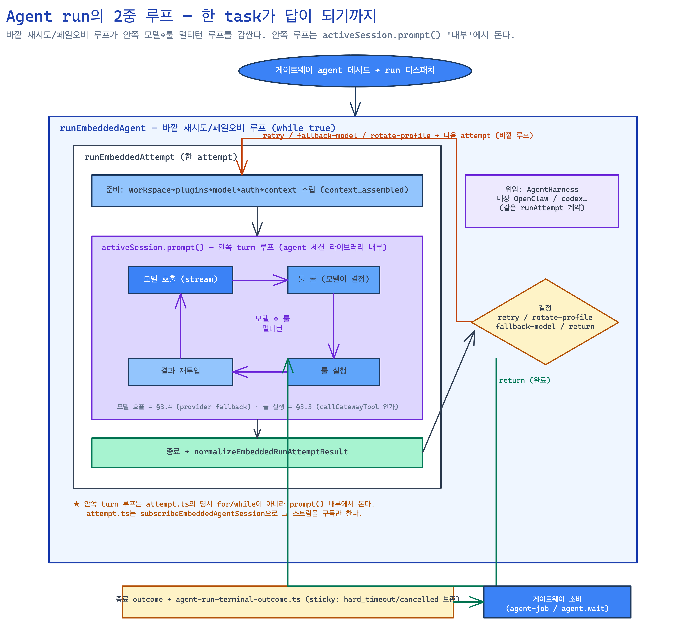

# OpenClaw 스터디 — Agent Runtime

> 대상: **`src/agents/*`** 외 (harness·llm·context-engine·sessions). 게이트웨이 스터디 §2 흐름의 **④ 에이전트 런타임** 한 칸을 확대한 자료.
> 방법: ultracode 멀티에이전트로 7개 영역 병렬 코드 매핑 → 정확성 비평(표본 spot-check) → 종합. 모든 `file:line`은 **`openclaw/openclaw@0fc5a57a`** 기준(working tree == 이 SHA). 핵심 파일만 링크, 나머지는 코드 스팬(에디터에서 클릭).
> 짝 자료: [gateway-study.md](./gateway-study.md) · [gateway-qa.md](./gateway-qa.md) · [openclaw-architecture.md](./openclaw-architecture.md).

---

## 0. 이 문서의 지도

게이트웨이 스터디가 "메시지가 채널→게이트웨이→에이전트로 흐르는 길"이었다면, 이 문서는 그 화살표 **④(에이전트 런타임)** 안에서 실제로 **모델을 부르고 툴을 돌리고 답을 만드는** 부분을 본다.

학습 순서: ① runtime이 뭐고 게이트웨이와 어떻게 맞물리나 → ② 한 run의 생애(큰 그림) → ③ 영역별 심화(실행루프/하니스/툴/모델/컨텍스트·메모리/세션·서브에이전트/설정·샌드박스) → ④ 비직관 포인트 → ⑤ 한 줄 요약.

**관통 원칙** (게이트웨이 스터디와 이어짐):
- **코어는 모델 구동을 직접 안 한다** — `AgentHarness` 계약에 위임. 내장 OpenClaw도 외부 Codex도 *같은 인터페이스*.
- **상태는 SQLite가 canonical** — auth profile(per-agent `openclaw-agent.sqlite`)·subagent_runs(공유 `state/openclaw.sqlite`)·세션 상태. 레거시 JSON은 doctor가 1회 임포트 후 삭제, runtime은 canonical만 읽음. (단 대화 transcript·세션 인덱스는 파일 — gateway-qa 참고.)
- **모델은 신뢰 주체가 아니다** — 툴 노출·config 변경·exec 실행은 다층 정책 + 최소권한 scope로 fail-closed.

---

## 1. Agent runtime이란 무엇이고, 게이트웨이와 어떻게 맞물리나

### 1.1 경계: 게이트웨이의 `agent` 메서드가 진입점

게이트웨이는 인바운드를 `agent:<id>:...` 세션키로 특정 에이전트에 매핑하고(`src/routing/session-key.ts:131-133,242-263`), `agent` 메서드로 run을 디스패치한다. 그 첫 갈림길이 [`src/agents/command/attempt-execution.ts`](https://github.com/openclaw/openclaw/blob/0fc5a57a34409782c8e0c9260cedbf788ed382d8/src/agents/command/attempt-execution.ts)`:558-603`:
- `isCliProvider`면 → `runCliAgent` (외부 CLI 서브프로세스 경로)
- 아니면 → `runEmbeddedAgent` (하니스 경로, `embedded-agent-runner/run.ts`)

즉 **agent runtime = "게이트웨이가 넘긴 한 task를, 모델과 툴을 엮어 user-facing 응답으로 바꾸는 부분"** 이고, 실제 모델 구동은 코어가 직접 하지 않고 `AgentHarness` 계약에 위임한다.

### 1.2 위로 / 아래로의 연결

- **위로(게이트웨이→runtime):** `agent` 메서드(in-process `dispatchGatewayMethodInProcess` 또는 WS `callGateway`)가 임베디드 러너를 깨운다.
- **아래로(runtime→게이트웨이):** 진행 상황을 `onExecutionPhase` 콜백으로 보고하고(`server-cron.ts:381` 전달), 종료 시 `agent-run-terminal-outcome.ts`가 정규화한 outcome을 게이트웨이 server-methods(`agent-job.ts`·`agent-wait-dedupe.ts`)가 sticky 규칙으로 소비.
- **툴이 다시 게이트웨이로:** 모델이 툴을 부르면 `callGatewayTool`이 게이트웨이 메서드를 되친다(§3.3). → runtime은 게이트웨이의 **클라이언트이자 콜백 대상** 양쪽.

---

## 2. 한 run의 생애 (큰 그림)

한 번의 사용자 메시지가 답으로 돌아오기까지의 **2중 루프 구조**가 핵심이다.



```
runEmbeddedAgent (바깥 = 재시도/페일오버 루프, while(true))
└ 매 iteration: runEmbeddedAttempt (한 attempt)
   ├ 준비:  workspace→plugins→model 해석→auth→context-engine
   │        → 컨텍스트 조립 → "context_assembled" phase 발행
   ├ 모델:  activeSession.prompt(prompt, options)  ← 안쪽 turn 루프가 여기서 돈다
   │        ┌──────────────────────────────────────────────┐
   │        │ 모델호출(streamSimple/fallback) → 툴콜          │  ← §3.4
   │        │   → 툴실행(callGatewayTool/exec) → 결과 재투입  │  ← §3.3
   │        │   → 재호출 …  (멀티턴)                          │
   │        └──────────────────────────────────────────────┘
   └ 종료:  terminal phase 정리 → normalizeEmbeddedRunAttemptResult → 바깥 루프로 반환

바깥 루프가 결과를 보고: retry / rotate-profile / fallback-model / return 결정
종료 outcome → agent-run-terminal-outcome.ts 정규화(sticky) → 게이트웨이 소비
완료 결과 → (서브에이전트면) steer/direct/handoff로 전달 (§3.6)
```

**가장 중요한 비직관 포인트(미리):** "안쪽 turn 루프"는 `attempt.ts`의 명시적 `for`/`while`이 **아니다.** `activeSession.prompt()`(agent 세션 라이브러리) **내부**에서 돌고, `attempt.ts`는 `subscribeEmbeddedAgentSession`으로 그 스트림을 *구독*만 한다. 그래서 **한 `prompt()` 호출 안에서 §3.1(루프)·§3.4(모델)·§3.3(툴)이 교차**한다. 이걸 모르면 "turn 루프 코드가 어디 있냐"를 영영 못 찾는다.

핵심: `run.ts:1508`(바깥 `while(true)`)·`:1625`(attempt 디스패치)·`:1779`(정규화) / `attempt.ts:3149-3155`(`prompt()` 호출)·`:3272-3356`(스트림 구독)

---

## 3. 영역별 심화

### 3.1 실행 루프 (embedded-agent-runner)

**무엇:** run의 2중 루프 — 바깥은 재시도/페일오버, 안쪽은 모델↔툴 멀티턴. 본체 [`embedded-agent-runner/run.ts`](https://github.com/openclaw/openclaw/blob/0fc5a57a34409782c8e0c9260cedbf788ed382d8/src/agents/embedded-agent-runner/run.ts).

**왜 2중인가:** 한 모델 호출이 rate-limit·인증만료·타임아웃으로 실패할 수 있으므로, attempt 단위로 잘라 retry/모델교체/프로필회전을 바깥에서 결정. attempt 경계를 넘는 상태(`nextAttemptPromptOverride`·`attemptedThinking`)는 다음 시도에 피드백(`run.ts:1547,1553-1556`).

**어떻게:**
- **바깥 루프:** 매 회 `runLoopIterations`++ → `MAX_RUN_LOOP_ITERATIONS` 초과 시 `handleRetryLimitExhaustion`(`run.ts:1509-1543`). 매 attempt마다 새 `AbortController` + 부모 signal relay(`run.ts:1614-1624`).
- **안쪽 루프:** `activeSession.prompt()`가 라이브러리 내부에서 모델→툴→피드백 반복(`attempt.ts:3149-3155`), `runToolLifecycle`이 개별 툴 실행 생애를 감쌈(`attempt.ts:3362`).
- **취소/abort:** `abortable()`이 signal과 prompt를 race해 abort 즉시 승리, non-Error reject도 AbortError로 정규화(`run/abortable.ts:25-46`). `isRunnerAbortError`(`abort.ts:7-20`), 세션 락 비차단 해제(`attempt-abort.ts:15-26`).
- **종료 정규화 + sticky:** [`agent-run-terminal-outcome.ts`](https://github.com/openclaw/openclaw/blob/0fc5a57a34409782c8e0c9260cedbf788ed382d8/src/agents/agent-run-terminal-outcome.ts)의 `buildAgentRunTerminalOutcome`이 reason을 **`hard_timeout > blocked > aborted > cancelled > timed_out > failed > completed`** 순으로 결정(플래그 `:104-111`, 삼항 체인 `:119-131`). `hard_timeout || cancelled`는 sticky(`:80`)라 늦은 cleanup이 못 덮음(`mergeAgentRunTerminalOutcome :190-216`), 단 `completedBeforeOrAtTimeout`이면 completed로 강등 허용. **rpc/stop은 *비성공* 종료일 때만 cancellation**(`:108-110`) — `stop`은 정상 성공일 수도 있어서.
- **phase 보고:** `EMBEDDED_AGENT_EXECUTION_PHASES`가 순서 라벨 정의(`execution-phase.ts:6-21`), 러너가 `notifyExecutionPhase`로 startup 단계를, attempt가 `context_assembled`/`model_call_started`를 직접 발행(`attempt.ts:4192,2900`).

**게이트웨이 소비:** `gateway/server-methods/agent-job.ts:68-93`·`agent-wait-dedupe.ts:320-326`가 sticky outcome 보존/dedupe. 타임아웃 phase enum은 `run-timeout-attribution.ts:2-24`.

### 3.2 하니스 / 백엔드 선택

**무엇:** runtime이 모델 구동을 위임하는 `AgentHarness` 계약([`harness/types.ts`](https://github.com/openclaw/openclaw/blob/0fc5a57a34409782c8e0c9260cedbf788ed382d8/src/agents/harness/types.ts)`:71-115`)과, provider/model에 따라 내장 vs 플러그인 하니스를 고르는 정책([`harness/selection.ts`](https://github.com/openclaw/openclaw/blob/0fc5a57a34409782c8e0c9260cedbf788ed382d8/src/agents/harness/selection.ts)).

**왜:** 코어는 plugin-agnostic이어야 하므로 모델 구동 책임을 계약 뒤로 숨긴다. 내장 OpenClaw도 외부 Codex도 동일 `runAttempt` 계약(`builtin-openclaw.ts:18`)이지만 **선택 정책은 다르다.**

**어떻게:**
- 위임은 한 줄: `run.ts:1625` → `run/backend.ts:10-14` → `selection.ts`의 `runAgentHarnessAttempt`.
- **runtime 정책 해석:** `policy.ts:27-52`가 config runtime id를 캐논화. 미설정/'default'→auto, openai는 codex 디폴트면 auto→codex 승격(`:40-47`).
- **선택 분기(fail-closed):** `selection.ts:133-263`. `runtime==='openclaw'`→강제 내장. 명시 runtime은 후보 id 매칭+`supports()` 확인 후 forced_plugin, **미지원이면 throw**(`:192-196`). `'auto'`만 priority 정렬로 플러그인 선택, 없으면 내장 폴백. **내장 'openclaw'는 후보 리스트에서 의도적으로 제외**(`:152-155`) → auto일 때만 폴백.
- **플러그인 lazy 로딩:** `runtime-plugin.ts:21`의 **`COLD_LOADABLE_HARNESS_PLUGIN_IDS = {codex, copilot}`** (※ `HARNESS_PLUGIN_IDS`라는 상수는 **없음**). `ensureSelectedAgentHarnessPlugin`이 선택 전 이들만 로드.
- **플러그인 하니스 실패 시 내장으로 폴백 안 하고 throw**(`selection.ts:297-305`). 하니스별 정책 차이: 비-openclaw는 `applyPluginHarnessDenyAllToolPolicy`(`:282,308-320`), Codex는 `deliveryDefaults`가 message_tool 기본.

**외부 CLI(claude-code/gemini)는 하니스가 아니다:** anthropic/google 확장이 `registerCliBackend`로 등록하는 **CLI 백엔드**이며, `selection.ts`에 *전혀 등장하지 않고*(grep 확인) `cli-runner` 서브프로세스로 실행(`cli-backends.ts:193-497` / `attempt-execution.ts:558` 분기 / `cli-runner/execute.ts:644` `supervisor.spawn`).

### 3.3 툴 시스템 (catalog / policy / gateway 호출 / exec host / 스키마)

**무엇:** 코어 툴 카탈로그를 데이터 테이블로 선언 → 다층 정책으로 모델 노출 툴을 거름 → provider별 스키마 정규화 → 실행 시 최소권한 scope로 게이트웨이 메서드 호출.

**왜:** 모델은 신뢰 주체가 아니다. 어떤 툴이 노출되고, config를 바꾸고, 명령을 실행하는지를 fail-closed로 통제.

**어떻게:**
- **카탈로그는 데이터:** `CORE_TOOL_DEFINITIONS`가 id/section/profiles/group 선언([`tool-catalog.ts`](https://github.com/openclaw/openclaw/blob/0fc5a57a34409782c8e0c9260cedbf788ed382d8/src/agents/tool-catalog.ts)`:60-351`), 프로필(minimal/coding/messaging/full)·그룹 파생. 인스턴스는 `createOpenClawCodingTools`가 조립(`agent-tools.ts:414,1113`).
- **다층 정책 파이프라인:** `applyToolPolicyPipeline`이 순서 있는 step(profile→provider→global→agent→group→sender→sandbox→subagent→inherited)을 `filterToolsByPolicy`로 적용(`tool-policy-pipeline.ts:48-208`).
- **실행 → 최소권한 인가:** `callGatewayTool(method, ..., {scopes})`가 백엔드 연결 생성([`tools/gateway.ts`](https://github.com/openclaw/openclaw/blob/0fc5a57a34409782c8e0c9260cedbf788ed382d8/src/agents/tools/gateway.ts)`:269-303`), scope 미지정 시 `resolveLeastPrivilegeOperatorScopesForMethod`(`method-scopes.ts:43-162`). **미분류 메서드는 빈 scope = default-deny.**
- **config 변경은 fail-closed allowlist:** `gateway` 툴의 config.apply/patch는 변경 dot-path가 `ALLOWED_GATEWAY_CONFIG_PATHS`에 속할 때만 통과(`gateway-tool.ts:45-348`).
- **exec host 분기:** 모델-facing host enum은 `auto|sandbox|gateway|node`로 **"local" 값 없음**(`bash-tools.schemas.ts:10-41`). `resolveExecTarget`이 auto→(sandbox 가용 시 sandbox, 아니면 **gateway**). `host==="node"`는 원격(`node.invoke system.run`), `gateway`는 **게이트웨이 프로세스 안 로컬 직접 실행**.
- **provider별 스키마 정규화:** `normalizeToolParameters`가 OpenAI(top-level union/anyOf 거부)·Gemini(constraint strip)·Anthropic별 변환(`agent-tools.ts:1152-1161`). 그래서 gateway/nodes 툴은 Union 대신 평탄한 `action` enum.

### 3.4 모델 / LLM 호출 (provider 라우팅·스트리밍·fallback·런타임 스위치·인증·캐시)

**무엇:** `model.api`로 등록된 provider를 `streamSimple`로 스트리밍 호출하고, primary→fallback 체인을 cooldown/인증 상태로 순회.

**어떻게:**
- **라우팅:** `streamSimple(model, ...)` → `packages/llm-runtime/src/stream.ts:43-50`이 `model.api`로 provider 조회. provider는 `register-builtins.ts:120-418`이 api id별 lazy 등록.
- **fallback 체인:** `resolveModelCandidateChain`이 primary + `agents.defaults.model.fallbacks`를 정규화·중복제거([`model-fallback.ts`](https://github.com/openclaw/openclaw/blob/0fc5a57a34409782c8e0c9260cedbf788ed382d8/src/agents/model-fallback.ts)`:867-980`). `runWithModelFallback`이 순서대로 시도, **primary는 절대 skip 안 됨**(`:1300-1303`). 모두 실패 시 `FallbackSummaryError` + 세션 suspend.
- **cooldown 프로브/skip:** 모든 auth 프로필 cooldown이면 `resolveCooldownDecision`이 skip/probe/suspend(`:1137-1206`). 프로브는 provider당 1회 throttle(`MIN_PROBE_INTERVAL_MS=30_000`).
- **/model 런타임 스위치:** 세션 store에 `liveModelSwitchPending` 플래그+override를 **disk 영속화**해 user `/model`과 시스템 fallback rotation을 구분, 깨끗한 retry 시점에만 적용(`live-model-switch.ts:148-227`).
- **인증 프로필:** per-agent `openclaw-agent.sqlite`에 저장(`auth-profiles/sqlite.ts:52-65`). 레거시 `auth-profiles.json`은 doctor 마이그레이션용, runtime은 SQLite. 채널/provider 자격증명은 `~/.openclaw/credentials/`에 별도.
- **프롬프트 캐시:** `resolveCacheRetention`이 provider family 게이트로 none/short/long(`prompt-cache-retention.ts:20-63`). 캐시 브레이크 판정은 **두 조건 AND** — `cacheRead < prev*0.95` **그리고** `tokenDrop >= 1000`(`MAX_STABLE_CACHE_READ_RATIO=0.95`, `MIN_CACHE_BREAK_TOKEN_DROP=1_000`).

### 3.5 컨텍스트 조립 & 메모리 & 압축

**무엇:** 매 턴 세션 JSONL을 sanitize→limit→assemble로 프롬프트화, 토큰 예산 초과 시 compaction이 DAG에 요약 엔트리 추가, 장기기억은 `MEMORY.md`를 시스템 프롬프트로 주입.

**어떻게:**
- **조립 파이프라인:** `attempt.ts:2918-3074`에서 sanitize→validateReplayTurns→heartbeat 필터→limitHistoryTurns→tool_use/result 페어링 복구→`engine.assemble`. **기본 legacy 엔진의 assemble은 pass-through**(`legacy.ts:39-55`) → 실제 조립 로직은 attempt.ts 파이프라인(엔진 아님).
- **플러그형 엔진 + fallback:** `plugins.slots.contextEngine`로 엔진 선택, 비기본 엔진이 throw/계약위반 시 quarantine 후 default로 조용히 강등([`context-engine/registry.ts`](https://github.com/openclaw/openclaw/blob/0fc5a57a34409782c8e0c9260cedbf788ed382d8/src/context-engine/registry.ts)`:888-983`). **단 `compact`/`prepareSubagentSpawn`은 fallback 없이 re-throw**(`:838-840`).
- **오버플로 트리거:** 전송 전 `shouldPreemptivelyCompactBeforePrompt`가 추정 토큰이 **(budget − reserveTokens) 절대 임계**(토큰 비율 아님)를 넘으면 라우팅(`preemptive-compaction.ts:263-344`). 전송 후 실패는 `run.ts:2164-2280` overflow 핸들러가 compact 재시도.
- **compaction 실행:** `compactEmbeddedAgentSessionDirect`(`compact.ts:457-1576`) → `agent-session.ts`의 `prepareCompaction→compact→appendCompaction`. 임계 기본 **`reserveTokens=16384`, `keepRecentTokens=20000`**(`packages/agent-core/.../compaction.ts:144-145`).
- **압축은 파괴적 삭제가 아니다:** append-only JSONL 트리에 **compaction 마커를 추가**하고, replay 시 합성 summary + `firstKeptEntryId` 이후 tail만 재생.
- **메모리 주입:** 워크스페이스 `MEMORY.md`(canonical) + `memory/*.md`. memory-core 플러그인이 promptBuilder로 시맨틱 검색 지시문 + `wiki_search`/`wiki_get` 등록, `buildMemoryPromptSection`이 결정적 순서로 주입.
- **히스토리 윈도잉(압축과 별개):** `limitHistoryTurns`가 세션키 정책(dmHistoryLimit/historyLimit)으로 최근 N user 턴만 남김(`history.ts:20-121`).

> ⚠️ `src/transcripts/*`는 **미팅/음성 캡처 저장소로 에이전트 세션 히스토리와 무관** — 이름이 비슷해 혼동 주의. (세션 히스토리는 `agents/<id>/sessions/`의 JSONL.)

### 3.6 세션 생애 · 서브에이전트 spawn · 응답 전달

**무엇:** 부모가 `sessions_spawn`으로 자식 세션(`agent:{id}:subagent:{uuid}`)을 게이트웨이 agent run으로 띄우고, registry가 SQLite durable outbox로 종료를 감시·재시도하며, 완료 결과를 steer→direct→handoff 순으로 전달.

**어떻게:**
- **자식 세션·격리/포크:** spawn마다 새 세션키([`subagent-spawn.ts`](https://github.com/openclaw/openclaw/blob/0fc5a57a34409782c8e0c9260cedbf788ed382d8/src/agents/subagent-spawn.ts)`:1245`). `contextMode="isolated"`면 빈 컨텍스트, `"fork"`면 부모 transcript 복제.
- **depth/capabilities 게이트:** 호출자 depth를 store의 `spawnDepth/spawnedBy` 사슬로 복구. `callerDepth >= maxSpawnDepth`(기본 1)면 forbidden, 활성 자식 ≥ `maxChildrenPerAgent`(기본 5)면 forbidden(`subagent-spawn.ts:1161-1179`). 자식 role(main/orchestrator/leaf) 계산, **leaf는 추가 spawn 불가**.
- **운영 상수 테이블:** `src/config/agent-limits.ts`에 spawn 한도뿐 아니라 동시성·아카이브 한도까지 한 파일 — `DEFAULT_SUBAGENT_MAX_SPAWN_DEPTH=1`(`:13`)·`DEFAULT_SUBAGENT_MAX_CHILDREN_PER_AGENT=5`(`:9`)·`DEFAULT_AGENT_MAX_CONCURRENT=4`(`:5`)·`DEFAULT_SUBAGENT_MAX_CONCURRENT=8`(`:7`)·`DEFAULT_SUBAGENT_ARCHIVE_AFTER_MINUTES=60`(`:11`).
- **spawn 실행:** `callSubagentGateway`가 `method="agent"`로 디스패치(in-process 또는 WS). 성공 시 `registerSubagentRun`으로 등록.
- **완료 감시:** `waitForSubagentCompletion`이 gateway `agent.wait` RPC로 감시. wait timeout이면 자식 session store status로 완료 추론. sweeper가 STALE 60s 후 orphan 회수.
- **durable delivery outbox:** 각 run의 `delivery.status`(not_required/pending/in_progress/delivered/failed/suspended/discarded)를 SQLite `subagent_runs`에 보관. 재시도 백오프, 만료(interactive 24h/subagent 6h/cron 2h)·압력캡으로 discard.
- **전달 라우팅:** ①부모 run 활성 시 `queueEmbeddedAgentMessage`로 **steer**(웨이크, 1순위) → ②실패 시 direct sendMessage → ③gateway "agent" 핸드오프 순(`announce-delivery.ts:1346-1443`). idempotencyKey로 1회만 커밋.

### 3.7 에이전트 config / 정체 / 샌드박스

**무엇:** `agents.list` + `agents.defaults` 병합으로 다수 에이전트(기본 main) 구성, 각 에이전트마다 전용 dir/SQLite/workspace로 격리, agent>global>default 우선순위로 샌드박스·툴 정책 해석.

**어떻게:**
- **agentId 구조:** `agents.list`가 비면 `listAgentIds`는 `DEFAULT_AGENT_ID="main"` 하나만 반환([`config/types.agents.ts`](https://github.com/openclaw/openclaw/blob/0fc5a57a34409782c8e0c9260cedbf788ed382d8/src/config/types.agents.ts)·`agent-scope-config.ts:73-89`). `resolveDefaultAgentId`는 `default:true` 항목 또는 첫 항목.
- **격리:** `resolveAgentDir`가 `state/agents/<id>/agent` 경로 생성, auth/state는 그 안 `openclaw-agent.sqlite`에. **중복 agentDir은 auth/세션 충돌로 에러**(`agent-dirs.ts:108-115`). workspace도 per-agent 분리.
- **샌드박스:** `resolveSandboxConfigForAgent`가 agent>defaults 병합으로 mode(off/non-main/all)·backend(기본 docker)·scope 해석. `shouldSandboxSession`: off=항상 비격리, all=항상 격리, **non-main=세션키가 main 세션키와 다를 때만** 격리(`runtime-status.ts:22-30`). docker backend는 readOnlyRoot·capDrop ALL·network none 강제.
- **per-agent 툴 정책:** `resolveSandboxToolPolicyForAgent`가 agent>global allow/alsoAllow/deny 병합, glob 매칭으로 deny>allow.

---

## 4. 비직관 포인트 (gotchas)

**실행 루프 / 하니스**
- **안쪽 turn 루프는 attempt.ts에 명시 루프로 없다** — `activeSession.prompt()` 내부에서 돌고 attempt.ts는 구독만. → 모델·툴이 한 `prompt()` 안에서 교차.
- **`stop` stopReason은 정상 성공일 수도 있다** → rpc/stop은 *비성공* 종료일 때만 cancellation.
- **`HARNESS_PLUGIN_IDS` 상수는 없다** → `COLD_LOADABLE_HARNESS_PLUGIN_IDS = {codex, copilot}`.
- **claude-code/gemini는 AgentHarness가 아니다** — CLI 백엔드(`registerCliBackend`), `selection.ts`에 안 나옴.
- **내장 'openclaw'는 하니스 후보 리스트에서 일부러 빠져 있다** → auto일 때만 폴백, 명시/미지원이면 fail-closed throw. 플러그인 하니스 실패도 폴백 안 하고 throw.

**툴 / 모델**
- **exec host에 "local" 값은 없다** — gateway 호스트가 로컬 실행, node가 원격.
- **미분류 게이트웨이 메서드는 빈 scope = default-deny.**
- **gateway 툴 config 변경은 allowlist 경로만 통과.**
- **primary 모델은 절대 skip 안 됨.**
- **캐시 브레이크는 두 조건 AND** — `cacheRead < prev*0.95` **그리고** `tokenDrop >= 1000`.
- **/model은 메모리 맵이 아니라 disk 플래그**로 영속화 → 시스템 fallback rotation과 구분.

**컨텍스트 / 세션 / config**
- **legacy 엔진 assemble은 pass-through** — 실제 조립은 attempt.ts 파이프라인.
- **compaction은 메시지를 삭제하지 않는다** — DAG에 마커 추가, replay 시점에 요약 적용.
- **`compact`/`prepareSubagentSpawn`은 quarantine fallback 대상이 아니라 re-throw.**
- **선제 compaction은 토큰 *비율*이 아니라 (budget − reserve) 절대 임계**로 라우팅.
- **모델 fallbacks `[]`(빈 배열)='폴백 없음 override', `undefined`='전역 상속'** — 의미 다름.
- **tool 정책 `allow:[]`는 '아무것도'가 아니라 '전부 허용'.**
- **`mode="non-main"`은 같은 에이전트의 메인 대화는 격리 안 함.**
- **`DEFAULT_AGENT_ID="main"` — 빈 list ≠ 에이전트 없음**, 항상 main 하나 존재. 각 에이전트는 고유 agentDir 필수(공유 시 충돌 에러).

**영역 가로지르는 일관성**
- **정책 레이어 전체 스택:** 한 툴이 모델에 노출되기까지 — 코어 1차(`agent-tools.ts:1113`) → bundled MCP/LSP 2차(`effective-tool-policy.ts`) → sandbox tool-policy(§3.7) → subagent deny(§3.6)가 중첩.
- **sticky 종료 outcome의 전파:** 한 정규화 함수(`agent-run-terminal-outcome.ts`)가 게이트웨이 소비(agent-job/wait-dedupe)와 서브에이전트 완료 감시(agent.wait) **두 소비처를 동일 규칙으로** 묶는 계약.

---

## 5. 한 줄 요약

> **OpenClaw agent runtime은 게이트웨이의 `agent` 메서드가 넘긴 한 task를, 바깥 재시도/페일오버 루프 안의 `AgentHarness`(내장 OpenClaw 또는 플러그인) 한 attempt로 실행하고, 그 attempt가 `activeSession.prompt()` 한 호출 안에서 "다층 정책으로 거른 툴 + provider-fallback 모델 + 압축된 컨텍스트"를 모델↔툴 멀티턴으로 엮어 답을 만든 뒤, sticky 종료 outcome으로 정규화해 게이트웨이/서브에이전트 양쪽에 전달하는 — 코어가 모델을 직접 몰라도 돌아가는 plugin-agnostic·SQLite-canonical 실행 엔진이다.**

---

> **추가 조사 후보** (이번 범위에서 얕게 다룬 것): top-level run **동시성·lane 스케줄링**(`DEFAULT_AGENT_MAX_CONCURRENT`), **steering 큐**가 활성 turn에 메시지를 주입하는 메커니즘, **exec 승인(approval) 라이프사이클**, **OAuth 토큰 refresh·cooldown 트리거**, **provider transport**(SSE/툴콜 델타 파싱).
