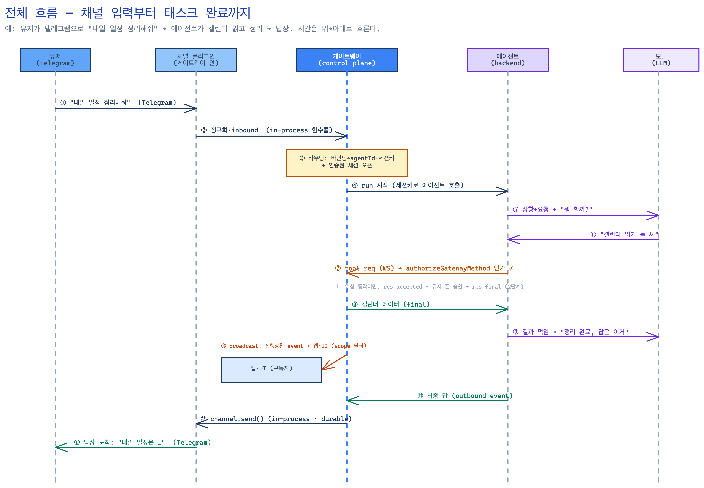

# OpenClaw Gateway 스터디 — 목표부터 게이트웨이 심층까지

---

# 1. OpenClaw의 목표 — 무슨 문제를 푸는가

**OpenClaw는 "내 기기에서 돌아가는, 항상 켜진 개인 AI 어시스턴트"다.** 패키지 설명 그대로 *"Multi-channel AI gateway with extensible messaging integrations."*

풀려는 문제를 셋으로 쪼개면:

1. **클라우드에 갇히지 않기 (local-first)** — 어시스턴트가 남의 서버가 아니라 *내 로컬 기기*에서 돈다. 내 데이터·자격증명·세션이 내 기기에 남는다.
2. **이미 쓰는 통로로 부르기 (multi-channel)** — 새 앱을 깔지 않고, Telegram·WhatsApp·Discord·Slack 등 **내가 이미 쓰는 메신저**로 어시스턴트를 호출하고 답을 받는다.
3. **항상 켜져 있고 빠르게 답하기 (always-on)** — 요청마다 새로 뜨는 게 아니라, **장수(long-lived) 프로세스**가 상주하며 채널을 물고 세션·메모리를 유지한다.

이 세 목표가 곧 게이트웨이의 존재 이유다. "local-first + multi-channel + always-on"을 동시에 만족하려면 **내 기기에 상주하면서 모든 채널과 에이전트를 묶는 중심 프로세스**가 필요한데, 그게 바로 게이트웨이다.

두 가지 관통 설계 원칙:
- **코어는 플러그인을 모른다(plugin-agnostic)** — 채널/기능은 `src/plugin-sdk/*` 계약으로만 코어에 진입.
- **상태는 전부 SQLite** — 전역 `state/openclaw.sqlite`, 에이전트별 `agents/<id>/agent/openclaw-agent.sqlite`. JSON 사이드카 안 씀.

*상태: 게이트웨이/에이전트가 요청 사이, 그리고 재시작 후에도 기억해야 하는 데이터 (휘발성 데이터 X)

---

# 2. 전체 구조 — 메시지가 흐르는 길

| 영역 | 경로 | 역할 |
|------|------|------|
| 코어 런타임 | [`src/`](https://github.com/openclaw/openclaw/tree/0fc5a57a34409782c8e0c9260cedbf788ed382d8/src) | 게이트웨이·에이전트 런타임·채널 인프라·CLI·config |
| 공유 패키지 | [`packages/*`](https://github.com/openclaw/openclaw/tree/0fc5a57a34409782c8e0c9260cedbf788ed382d8/packages) | `gateway-protocol`, `gateway-client`, `plugin-sdk` 등 |
| 플러그인 | [`extensions/*`](https://github.com/openclaw/openclaw/tree/0fc5a57a34409782c8e0c9260cedbf788ed382d8/extensions) | 채널·기능 통합. 내부명 "extensions", 제품명 "plugins" |
| 네이티브 앱 / UI | `apps/*`, `ui/` | android·ios·macos 클라이언트, 웹 제어 대시보드 |

**메시지가 흐르는 큰 길** (양방향):

```
① 외부 플랫폼(Telegram 등)
     │ 각 플랫폼 고유 프로토콜
     ▼
② 채널 플러그인 ──(게이트웨이 안, in-process)── 정규화·라우팅(fan-in)
     ▼
③ 게이트웨이 ── 어느 에이전트로 보낼지 결정, 세션 오픈
     ▼
④ 에이전트 런타임 ── LLM(src/llm) + 툴(src/tools) + 메모리(SQLite)
     │  결과를 이벤트로 게이트웨이에 올림(outbound)
     ▼
⑤ 게이트웨이 ── durable delivery 정책으로 채널 어댑터에 전달 → 같은 채널로 역방향 응답
```

핵심은 **단 하나의 장수 게이트웨이가 control plane이자 single source of truth(SSOT)** 라는 것.

---

# 3. 게이트웨이

## 3.0 게이트웨이란 무엇인가 (역할)

게이트웨이는 [`src/gateway/server.impl.ts`](https://github.com/openclaw/openclaw/blob/0fc5a57a34409782c8e0c9260cedbf788ed382d8/src/gateway/server.impl.ts)가 본체인 **상주 프로세스**다. 헤더 한 줄이 책임을 요약한다:

> *"builds runtime state, method registries, HTTP and WebSocket surfaces, config reload hooks, and graceful restart/shutdown."*

즉 게이트웨이는 **① 앱·CLI·웹UI·노드·에이전트가 붙는 WS 서버**, **② 메서드 RPC 레지스트리(채널·세션·승인·노드…)**, **③ 이벤트 broadcast 허브**, **④ 인증·인가 경계**, **⑤ 채널 플러그인 매니저**, **⑥ 멀티 에이전트 라우터**를 한 몸에 가진다. 기본 바인드는 `127.0.0.1:18789`.

> **게이트웨이에 WS로 붙는 주체는 셋**:
>
> | 주체 | 정체 | 누가 모나 |
> |---|---|---|
> | **앱·CLI·웹UI** | 사람이 쓰는 인터페이스 | **사람(유저)** |
> | **노드**(`node-host`) | 원격/모바일 백엔드 | 다른 기기 |
> | **에이전트**(`gateway-client`, backend) | LLM 행위자 | **모델** |

이 중 **②③④가 게이트웨이를 단순 메시지 중계가 아니라 "권한이 강제되는 control plane"으로 만드는 핵심 장치**다.

### ② 메서드 RPC 레지스트리 — "할 줄 아는 일들의 목록"

앱·CLI·웹UI·에이전트가 `req {method, params}`로 호출할 수 있는 **모든 메서드를 이름→핸들러로 묶어둔 표**. 게이트웨이의 API 표면 전체다([`server-methods.ts`](https://github.com/openclaw/openclaw/blob/0fc5a57a34409782c8e0c9260cedbf788ed382d8/src/gateway/server-methods.ts)).

핸들러는 **패밀리별 lazy 등록** — `coreGatewayHandlers`가 `createLazyCoreHandlers({methods, loadHandlers})`를 20여 번 펼쳐 만든다. 각 패밀리 모듈은 *그 메서드가 처음 호출될 때* 로드된다(startup이 가벼움, §always-on).

> **"패밀리(family)"란?** 관련 메서드들을 한 모듈로 묶은 그룹이다. 예컨대 `sessions.list`·`sessions.send`·`sessions.abort`…가 모두 `server-methods/sessions.ts` 한 파일에 들어있고, 이 묶음이 **"sessions 패밀리"**. 즉 *같은 모듈이 책임지는 메서드들의 집합*. `chat.*`·`cron.*`·`models.*`… 식으로 점(`.`) 앞 이름이 대체로 한 패밀리다.
>
> **"20여 번 펼쳐 만든다"란?** `createLazyCoreHandlers(...)`를 **패밀리 개수만큼(약 20번)** 호출하고, 각 호출이 돌려준 작은 맵 조각을 `...`(JS **스프레드**)로 `coreGatewayHandlers` **하나에 풀어 합친다**는 뜻. "펼친다 = 스프레드로 그 조각의 키들을 바깥 객체에 풀어 넣는다." 그래서 파일은 패밀리별로 나뉘어도, 런타임엔 **단일 레지스트리**가 된다.

```
coreGatewayHandlers = {
  ...lazy(["connect"]),  ...lazy(["chat.*"]),    ...lazy(["sessions.*"]),   // 패밀리 1, 2, 3
  ...lazy(["cron.*"]),   ...lazy(["node.*"]),    ...lazy(["exec.approvals.*"]),
  ...lazy(["models.*"]), ...lazy(["config.*"]),  ...lazy(["tools.*"]) ...    // … 약 20개 패밀리
}
// 각 ...lazy(...) = createLazyCoreHandlers 1회 = 패밀리 1개치 조각 맵을 펼쳐 넣음
```

요청 1건이 처리되는 길 (`handleGatewayRequest`):
```
req → authorizeGatewayMethod(④) → 쓰기 레이트리밋
    → methodRegistry.getHandler(method) → 핸들러 실행 → respond(ok, payload)
```

핵심:
- 대표 패밀리: `chat.*` · `sessions.*` · `channels.*` · `cron.*` · `node.*` · `device.*` · `exec.approvals.*` · `models.*` · `config.*` · `tools.*` · `talk.*`
- **플러그인도 메서드를 등록**한다(코어 핸들러 + `activeRegistry.gatewayMethodDescriptors`). 단 `normalizePluginGatewayMethodScope()`로 admin 사칭 차단.
- 즉 "게이트웨이가 SSOT로서 소유한 모든 동작"이 이 한 표를 진입점으로 거친다.

### ③ 이벤트 broadcast 허브 — "서버가 먼저 미는 확성기"

`res`(요청 응답)와 **별개로**, 상태 변화를 **구독한 앱·UI·노드(세션을 들여다보는 쪽)**에게 `event` 프레임으로 밀어내는 장치([`server-broadcast.ts`](https://github.com/openclaw/openclaw/blob/0fc5a57a34409782c8e0c9260cedbf788ed382d8/src/gateway/server-broadcast.ts)).

두 함수: `broadcast(event, payload)`(연결된 모두에게) / `broadcastToConnIds(...)`(특정 연결에게만). 연결마다 돌며 셋을 적용:

- **(a) 이벤트별 scope 가드** — `EVENT_SCOPE_GUARDS`가 이벤트마다 필요 스코프 선언 → **권한 없는 연결엔 안 보냄**.
  ```
  agent / chat / session.message / sessions.changed → [READ]
  exec.approval.* / plugin.approval.*               → [APPROVALS]
  device.pair.* / node.pair.*                       → [PAIRING]
  tick / presence / shutdown / health               → []  (누구나)
  ```
- **(b) per-client 단조 seq** — 연결마다 순번을 매겨 보냄 → 받는 쪽이 `seq`로 **누락(gap) 감지** 후 재동기. 단 targeted 이벤트는 seq 미부여.
- **(c) 느린 소비자 보호** — 어떤 연결의 `socket.bufferedAmount > MAX_BUFFERED_BYTES`면 이벤트를 버리거나(`dropIfSlow`) 연결을 끊는다. 한 느린 연결이 게이트웨이 메모리를 무한정 먹는 걸 차단.

→ 새 메시지·세션 변화·승인 요청·presence가 **받는 앱·UI가** 묻기 전에 흐르고, **이벤트조차 scope로 필터**되어 권한 없는 연결은 "그 일이 일어난 줄도 모른다."

### ④ 인증·인가 경계 — "모든 출입을 검문하는 관문"

모든 연결의 신원을 확인(인증)하고 모든 메서드 호출의 권한을 검사(인가)하는 단일 관문.

- **인증** — `connect` 핸드셰이크에서 자격증명+device 서명 검증 → **granted role+scopes를 연결에 고정**(`client.connect.scopes`). 이 값은 §"상태"의 `device_auth_tokens`·`device_pairing_paired`에서 조회된다. → 권한이 **연결당 1회** 확정되고, 이후 요청은 이 값을 못 부풀린다.
- **인가** — 매 req마다 디스패치 직전 `authorizeGatewayMethod`가 검사([`server-methods.ts:221`](https://github.com/openclaw/openclaw/blob/0fc5a57a34409782c8e0c9260cedbf788ed382d8/src/gateway/server-methods.ts#L221)):
  ```
  role = parseGatewayRole(connect.role ?? "operator")  → 실패 "unauthorized role"
  if (!isRoleAuthorizedForMethod(role, method))         → "unauthorized role"
  if (role === "node") return ok
  if (scopes.includes(ADMIN_SCOPE)) return ok
  if (!authorizeOperatorScopesForMethod(...).allowed)  → "missing scope: X"
  ```
  → **granted(연결 허용) ⊇ required(메서드 필요)** 검사. **default-deny**: 모르는 메서드는 admin을 요구해 자동 거부([`method-scopes.ts:160`](https://github.com/openclaw/openclaw/blob/0fc5a57a34409782c8e0c9260cedbf788ed382d8/src/gateway/method-scopes.ts#L160), [`:192`](https://github.com/openclaw/openclaw/blob/0fc5a57a34409782c8e0c9260cedbf788ed382d8/src/gateway/method-scopes.ts#L192)).

**세 역할의 관계 — ④가 ②③를 감싼다:**
```
        ┌──────────── ④ 인증·인가 경계 ────────────┐
req ───▶│ connect 때 신원·권한 고정                 │
        │   ↓ 매 req: authorizeGatewayMethod        │
        │   ├─▶ ② 메서드 레지스트리 → handler 실행   │
        │   └─▶ ③ broadcast(event) ─ scope 필터 ─▶ 구독자(앱·UI·노드)
        └──────────────────────────────────────────┘
```
이 셋이 합쳐져 **모든 동작(②)과 모든 이벤트(③)가 권한(④)을 통과**하게 만든다.

### ⑥ 멀티 에이전트 라우터 — "인바운드를 어느 에이전트로?"

에이전트를 여럿(각자 `agentId`·전용 SQLite) 둘 수 있고, 게이트웨이가 들어온 메시지를 적절한 에이전트로 보낸다([`resolve-route.ts`](https://github.com/openclaw/openclaw/blob/0fc5a57a34409782c8e0c9260cedbf788ed382d8/src/routing/resolve-route.ts)).

- **인바운드가 들고 오는 것**: 채널 · 계정 · 상대방(peer: DM/그룹/길드, peerId, peerKind).
- **바인딩 우선순위 매칭** (운영자가 config에 설정, **구체적인 것부터**):
  ```
  binding.peer → guild+roles / team → binding.account → binding.channel → (없으면) 기본 "main"
  ```
  예: "텔레그램 이 그룹 → `work` 에이전트" / "이 채널 전체 → `main`". 더 구체적인 규칙이 이기므로 같은 채널이라도 특정 그룹만 다른 에이전트로 보낼 수 있다.
- **결과 = 세션키** `agent:<agentId>:<channel>:<peerKind>:<peerId>` — 어느 에이전트의 *어느 대화*인지 유일 식별. 세션 스토어가 이 키로 맥락·메모리를 저장하므로 **같은 대화는 늘 같은 에이전트·세션**으로 이어진다.
- **연속성**: 첫 라우팅 후 `current_conversation_bindings`(§상태)에 현재 라우트를 기록해 매번 다시 안 따진다.

```
Telegram 그룹X → 채널 플러그인 → 게이트웨이
   → resolveRoute: 바인딩 매칭 → agentId="work" (없으면 "main")
   → 세션키 agent:work:telegram:group:그룹X → work 에이전트 세션 오픈 → run
```

---

## 3.1 왜 WebSocket?

한 줄: **게이트웨이는 "요청-응답 서버"가 아니라 "양방향으로 이벤트를 계속 밀어내는 장수 control plane"이라서.**

HTTP 요청-응답 1:1 모델로는 표현 못 하는 게 게이트웨이엔 본질적으로 존재한다:

1. **한 요청이 한 번에 안 끝난다 (2단계 응답).** 에이전트 run·승인 대기처럼 오래 걸리는 작업은 "접수됨(accepted)"을 먼저 돌려주고 결과(final)는 나중에 온다. → 하나의 `req`에 `res`가 두 번.
2. **서버가 받는 쪽에 먼저 민다 (push).** 새 inbound 메시지, 세션 변화, 노드 상태, 토큰 스트리밍을 **앱·UI 등 받는 쪽이** 묻기도 전에 게이트웨이가 밀어낸다([`server-broadcast.ts`](https://github.com/openclaw/openclaw/blob/0fc5a57a34409782c8e0c9260cedbf788ed382d8/src/gateway/server-broadcast.ts), [`server-session-events.ts`](https://github.com/openclaw/openclaw/blob/0fc5a57a34409782c8e0c9260cedbf788ed382d8/src/gateway/server-session-events.ts)).
3. **구독(subscription)** — **앱·UI·노드가** 세션/노드를 구독하고 지속적으로 업데이트를 받는다.
4. **프레즌스** — 지속 소켓에서는 **끊김이 곧 이탈 신호**. 하트비트(`tick`)로 생존을 안다.

WebSocket은 이 넷을 한 연결 위에서 자연스럽게 멀티플렉싱한다. 그래서 WS다.

> **단, WS-only가 아니다.** stateless 단발(웹UI 정적자원, 임베딩, health 프로브)은 HTTP를 병행한다([`server-http.ts`](https://github.com/openclaw/openclaw/blob/0fc5a57a34409782c8e0c9260cedbf788ed382d8/src/gateway/server-http.ts)). "지속·양방향은 WS, 단발은 HTTP"라는 의도적 분리다.

---

## 3.2 왜 이런 구조인가 — 단일 허브 + 신뢰 경계

### (a) 왜 모든 걸 하나의 허브에 모았나 (별 토폴로지)

게이트웨이는 **single source of truth**다. 채널·세션·라우팅·승인·노드 상태를 한 프로세스가 쥔다. 왜?

- **권한 검사를 한 곳에서 강제**할 수 있다 (§3.3).
- 상태가 한 정본에 모여 **일관성**이 보장된다 (분산 상태의 동기화 지옥 회피).
- 에이전트가 로컬이든 원격이든 **동일하게 control plane만 호출**하면 된다.

그래서 모두가 게이트웨이 하나에 붙고 서로 직접 안 붙는 **별(star) 토폴로지**가 된다.

### (b) 왜 채널은 안에, 에이전트는 WS 밖인가 (신뢰 경계)

같은 "부품"인데 채널과 에이전트의 처지가 다르다:

| | 채널 | 에이전트 |
|---|---|---|
| 코드 성격 | 1st-party 전송 어댑터, 결정적 | **LLM 출력으로 동작** (프롬프트 인젝션 표면) |
| 신뢰도 | 신뢰됨 | 준-비신뢰 — 행동마다 인가 필요 |
| 위치 | 항상 게이트웨이 안 | embedded **또는** 원격 노드 |
| 수명 | 게이트웨이와 함께 | run 단위로 생성·취소·크래시 |

→ **채널은 게이트웨이 안의 in-process 플러그인**으로 둔다([`server-channels.ts:1`](https://github.com/openclaw/openclaw/blob/0fc5a57a34409782c8e0c9260cedbf788ed382d8/src/gateway/server-channels.ts#L1) *"Gateway channel manager. Starts, stops, restarts... plugin channel account runtimes"*). 신뢰되는 코드라 경계가 필요 없다.

→ **에이전트는 인증된 WS 경계 뒤**에 둔다(`gateway-client`/`backend` 모드). 모델이 모는 준-비신뢰 행위자라 행동마다 인가받아야 하고, 위치가 바뀌며, 죽을 수 있기 때문. **그래서 같은 머신 embedded일 때조차 loopback WS를 거친다** — 직렬화 비용을 감수하고도 인증·최소권한·끊김감지 되는 경계를 일관되게 유지하려고.

### (c) 왜 메서드마다 인가 + default-deny인가

에이전트 행동은 모델이 결정한다(인젝션 위험). 그래서 **모든 행동을 인증된 WS RPC 한 곳으로 강제**하고, 메서드별 최소권한 스코프를 검사한다. 모호하면 막는다(fail-closed).

---

## 3.3 메커니즘

### (a) 3프레임 프로토콜 + 핸드셰이크

와이어는 단 3종 프레임으로 멀티플렉싱된다([`schema/frames.ts`](https://github.com/openclaw/openclaw/blob/0fc5a57a34409782c8e0c9260cedbf788ed382d8/packages/gateway-protocol/src/schema/frames.ts)):

| 프레임 | 방향 | 의미 |
|---|---|---|
| `req {id, method, params}` | 보내는 쪽 → 게이트웨이 | 요청 |
| `res {id, ok, payload, error}` | 게이트웨이 → 요청 보낸 쪽 | **요청 id에 짝지어진 응답** |
| `event {event, payload, seq, stateVersion}` | 게이트웨이 → 구독자 | **id 없는 일방 push** |

연결은 `connect`(자격증명·device 서명·요청 스코프) → `hello-ok`(협상된 protocol·features·snapshot·**granted role+scopes**·policy)로 시작한다. **핵심: 권한이 이 핸드셰이크에서 연결에 박힌다.**

### (b) 2단계 응답(accepted→final)은 어떻게 도나

**에이전트**(요청 보내는 쪽)가 한 요청을 보내고 `res`를 두 번 받는다([`gateway-client/src/client.ts:1330`](https://github.com/openclaw/openclaw/blob/0fc5a57a34409782c8e0c9260cedbf788ed382d8/packages/gateway-client/src/client.ts#L1330)):

```
res 도착 → pending(그 id) 찾음
  if (expectFinal && payload.status === "accepted") {
      onAccepted(payload); return;   // ★ Promise 안 풀고 대기 유지 (ack)
  }
  pending.delete(id); ok? resolve : reject   // 두 번째 res = 최종 결과
```

동시에 `event`가 `seq`(누락 감지)·`tick`(하트비트)·`stateVersion`(상태 동기)으로 **독립 스트림**을 이룬다. → 한 소켓 위 **이중 멀티플렉싱**: id 2단계 응답 + seq 일방 이벤트.

### (c) always-on을 어떻게 떠받치나

- **lazy 부팅** — [`server.ts`](https://github.com/openclaw/openclaw/blob/0fc5a57a34409782c8e0c9260cedbf788ed382d8/src/gateway/server.ts)가 구현체를 동적 import 뒤에 두고, 핸들러 패밀리도 첫 호출 때 로드 → startup 비용 절감.
- **presence/health** — 채널 health monitor(기본 5분 주기)와 tick 하트비트로 생존 추적.
- **graceful restart/shutdown** — [`server-close.ts`](https://github.com/openclaw/openclaw/blob/0fc5a57a34409782c8e0c9260cedbf788ed382d8/src/gateway/server-close.ts)가 채널·세션·cron을 순서대로 drain하고, [`server-restart-sentinel.ts`](https://github.com/openclaw/openclaw/blob/0fc5a57a34409782c8e0c9260cedbf788ed382d8/src/gateway/server-restart-sentinel.ts)가 재시작 후 pending 작업을 재개. 항상 켜진 데몬이 안전하게 갱신된다.

---

## 3.4 다른 것들과의 차별점

### vs 클라우드 어시스턴트 (ChatGPT·Claude.ai 등)
- 저쪽: **control plane이 벤더 서버**에 있고, 데이터·세션·도구 실행이 클라우드에 귀속. 사용자는 클라이언트일 뿐.
- OpenClaw: **control plane이 내 기기**. 게이트웨이가 내 노트북/VPS에서 SSOT로 돌고, 자격증명·세션·메모리가 로컬 SQLite에 남는다. → *소유권·프라이버시·오프라인성*이 근본적으로 다르다.

### vs 에이전트 프레임워크/라이브러리 (LangChain·AutoGPT류)
- 저쪽: 대개 **호출형 라이브러리**. 스크립트가 돌 때만 살아있고, 멀티채널 수신·세션 상주·프레즌스 개념이 없다.
- OpenClaw: **상주 데몬 + 멀티채널 게이트웨이**. 여러 메신저에서 들어오는 걸 fan-in해 하나의 에이전트로 라우팅하고, 세션·승인·노드를 지속 관리. → *라이브러리 vs 상시 가동 허브*.

### vs 단일 채널 봇 (텔레그램 봇 하나 등)
- 저쪽: 채널 1개에 묶인 핸들러. 채널이 늘면 코드가 갈라진다.
- OpenClaw: 채널은 **전송 전용 플러그인**(in-process)으로 표준화되고, 제품 로직은 게이트웨이/에이전트가 소유. 채널 추가 = 플러그인 추가. → *N채널을 한 두뇌로*.

### vs MCP 단독 / 순수 RPC 툴 연결
- MCP는 "툴/리소스 연결 프로토콜"이다. OpenClaw 게이트웨이는 그 역할(툴·승인·인가)을 **포함하면서** 채널 수신·세션·프레즌스·라우팅까지 묶은 **상위 control plane**이다. 실제로 게이트웨이의 인가 모델은 **MCP/OAuth 2.1의 capability-scope 모델과 정렬**된다(아래).

### vs Hermes Agent (같은 local-first 동류)
- 둘 다 local-first 개인 에이전트지만, **Hermes의 핵심 차별점은 "성장(growth)"** (경험에서 스킬 생성·자기개선). OpenClaw는 **멀티채널 게이트웨이 + plugin-agnostic 코어 + SQLite 단일정본**이라는 *플랫폼/런타임 엄밀성*에 무게가 실린다. (짝 비교: [Hermes 분석 §9](../hermes-agent-study/hermes-agent-architecture.md))

→ **차별점의 본질**: 개별 기법은 표준이지만, 이걸 *"내 기기에 상주하는 멀티채널 개인 에이전트의 control plane"* 이라는 한 점으로 묶어낸 **조합과 경계 설계**가 OpenClaw 게이트웨이의 정체성이다.

---

## 요약 — 한 장으로

- **목표**: local-first + multi-channel + always-on 개인 어시스턴트 → 그래서 상주 중심 프로세스(게이트웨이)가 필요.
- **구조**: 단 하나의 게이트웨이가 SSOT. 모두가 WS로 붙는 별 토폴로지.
- **왜 WS**: 2단계 응답 + 서버 push + 구독 + 프레즌스를 한 소켓에 멀티플렉싱 (단발은 HTTP 병행).
- **왜 이 구조**: SSOT로 일관성·인가를 한 곳에; 신뢰되는 채널은 안에, 준-비신뢰 에이전트는 인증 WS 경계 뒤에.
- **어떻게**: 3프레임 + 핸드셰이크 권한 바인딩 + 매호출 `authorizeGatewayMethod` + default-deny + lazy/presence/restart.
- **차별점**: 클라우드 어시스턴트·라이브러리·단일봇·MCP 단독과 다른 "내 기기 멀티채널 control plane"; 개별 기법은 JSON-RPC/AIP-151/MCP·OAuth/인젝션 보안 정설의 조합.

> **local-first를 장점으로 보는 것에 대한 개인적인 생각 <br>**
> 로컬에 상주한다는 게 장점인지는? 잘 모르겠다. 일반 오픈소스 에이전트도 Ollama같은 툴을 이용해 로컬에서
> 구동이 가능하다. 하지만, 결국 이건 하드웨어가 어느정도 받춰주어야 하는 점인데, 하드웨어 성능이 안좋은 유저는
> 대부분 api로 사용을 하는 것으로 알고 있는데, 이 방법은 비용이 꽤 많이 든다. 그리고 이게 로컬이라고 하면 그건
> 또 아닌 것 같다.

---

## 전체 흐름 다이어그램 — 채널 입력부터 태스크 완료까지

예시 시나리오: **유저가 텔레그램으로 "내일 일정 정리해줘" → 에이전트가 캘린더 읽고 정리 → 답장.** 지금까지 본 모든 조각(채널 in-process·라우팅·인증/인가·에이전트↔모델 루프·툴 인가·2단계 응답·broadcast·durable 전송)이 한 왕복에 어떻게 맞물리는지 보여준다.



1. 유저가 채널(Telegram)로 입력
2. 채널 플러그인이 정규화해 게이트웨이로 (in-process)
3. 게이트웨이 **라우팅**: 바인딩→agentId·세션키, 인증된 세션 오픈 (§3.0 ⑥)
4. 게이트웨이가 해당 **에이전트** run 시작
5~6. 에이전트 ↔ **모델(LLM)**: "뭐 할까?" → "캘린더 툴 써"
7. 에이전트 툴 → 게이트웨이 **WS 호출** → `authorizeGatewayMethod` **인가** (§3.0 ④) — 위험 동작이면 **accepted→유저 승인→final** 2단계 (§3.3 b)
8~9. 캘린더 데이터 받아 모델에 먹임 → 정리 완료
10. 진행상황은 **broadcast**로 앱·UI에 실시간 (scope 필터, §3.0 ③)
11~13. 최종 답을 게이트웨이가 받아 **channel.send()**(in-process·durable) → 같은 채널로 답장

> 핵심: 유저↔채널은 플랫폼 프로토콜, 채널↔게이트웨이는 in-process, **에이전트↔게이트웨이만 WS**. 그리고 에이전트의 모든 행동(⑦)은 인가 관문을 통과한다.