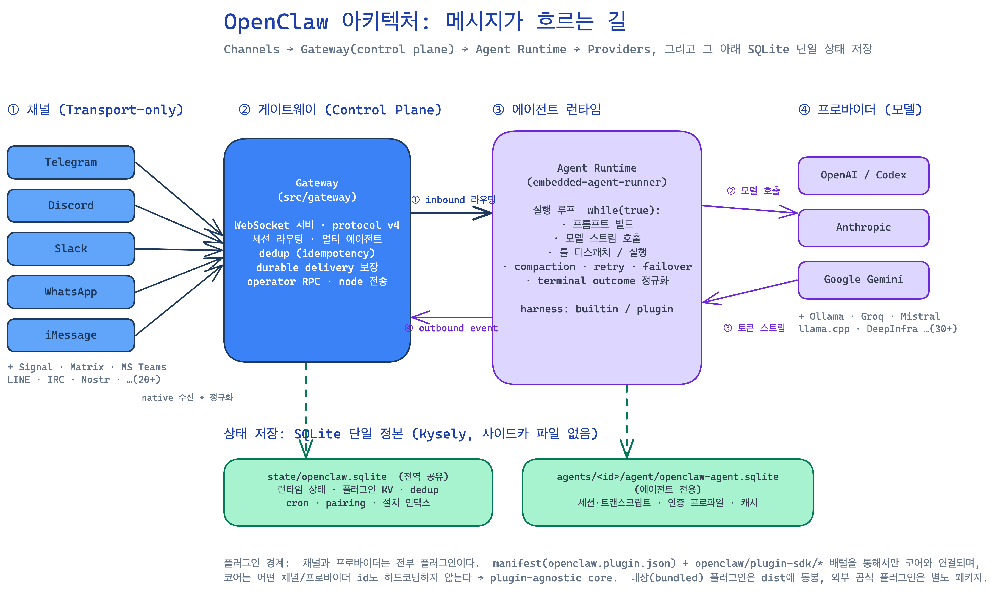
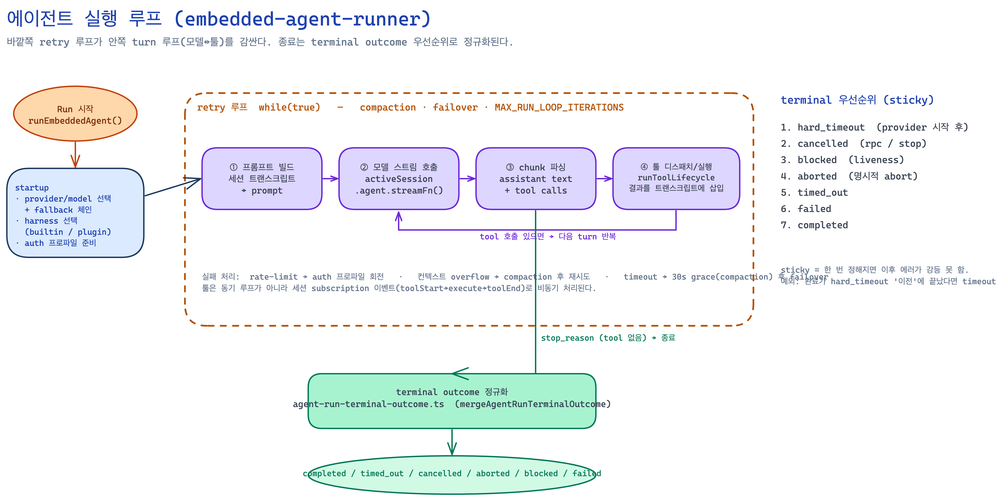
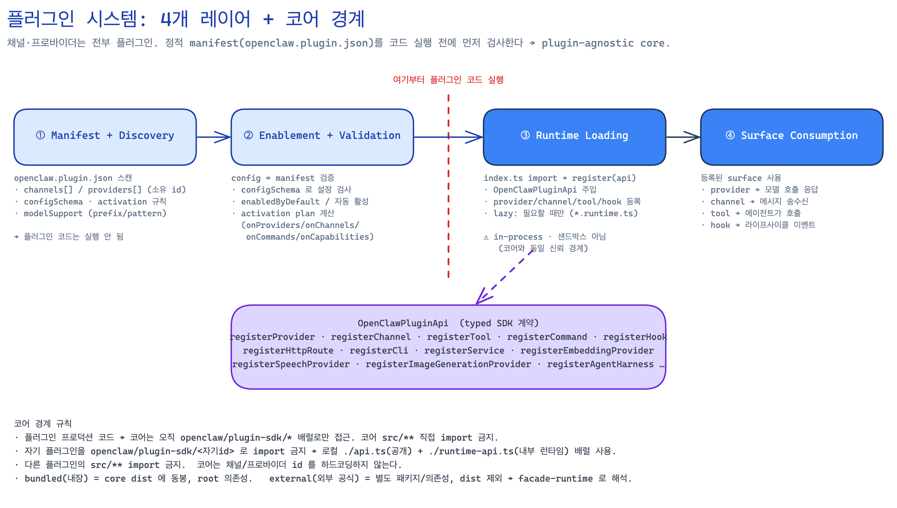

# OpenClaw 동작 방식·원리·구조 분석

> 작성: 로컬 소스 트리(`/openclaw`, main HEAD `0fc5a57a`) 직접 분석 + 공개 문서(`docs.openclaw.ai`) 교차검증(25개 주장 3‑0 검증 통과).
> 코드 링크는 canonical 소스 [`openclaw/openclaw@0fc5a57a`](https://github.com/openclaw/openclaw/tree/0fc5a57a34409782c8e0c9260cedbf788ed382d8)에 고정되어 있어 라인/내용이 분석 시점과 일치한다. 클릭하면 해당 파일로 이동한다.

---

## 1. OpenClaw란 무엇인가 — 무슨 문제를 푸는가

**OpenClaw는 "내 기기에서 직접 돌리는 1인용(self‑hosted, single‑user) 개인 AI 비서"다.** 이미 쓰고 있는 메신저(WhatsApp·Telegram·Slack·Discord·Signal·iMessage·WebChat 등)로 비서에게 말을 걸면, 그 메시지가 로컬에서 도는 AI 에이전트로 라우팅되어 답이 돌아온다.

- `README.md:21` — *"OpenClaw is a personal AI assistant you run on your own devices. It answers you on the channels you already use."*
- 패키지 설명(`package.json`) — *"Multi-channel AI gateway with extensible messaging integrations"*

**해결하는 문제:**
1. **파편화된 메신저 통합** — 여러 채팅 앱에 흩어진 대화를, 하나의 로컬 비서가 받아 처리.
2. **데이터 주권 / 로컬‑퍼스트** — SaaS에 의존하지 않고 본인 기기에서 실행. 상태·세션·자격증명이 로컬에 머문다.
3. **항상 켜져 있고(always‑on) 빠른 응답** — 게이트웨이가 장수(long‑lived) 프로세스로 상주.
4. **모델/채널 선택의 자유** — 어떤 LLM 프로바이더든, 어떤 채널이든 플러그인으로 끼운다.

**대상:** 데이터 통제권을 포기하지 않으면서 어디서든 메시지로 부릴 수 있는 개인 비서를 원하는 개발자·파워유저.

### 리포지토리 한눈에

모노레포(pnpm workspace, [`pnpm-workspace.yaml`](https://github.com/openclaw/openclaw/blob/0fc5a57a34409782c8e0c9260cedbf788ed382d8/pnpm-workspace.yaml)). 핵심 영역:

| 경로 | 역할 |
|------|------|
| [`src/`](https://github.com/openclaw/openclaw/tree/0fc5a57a34409782c8e0c9260cedbf788ed382d8/src) | 코어 TS — 게이트웨이·에이전트 런타임·채널 인프라·CLI·config·cron·daemon |
| [`extensions/`](https://github.com/openclaw/openclaw/tree/0fc5a57a34409782c8e0c9260cedbf788ed382d8/extensions) | 번들 플러그인(채널·프로바이더·툴) — 140+개 |
| [`packages/`](https://github.com/openclaw/openclaw/tree/0fc5a57a34409782c8e0c9260cedbf788ed382d8/packages) | 공유 라이브러리 — `gateway-protocol`, `plugin-sdk`, `llm-core`, `model-catalog-core` 등 |
| [`ui/`](https://github.com/openclaw/openclaw/tree/0fc5a57a34409782c8e0c9260cedbf788ed382d8/ui) | 게이트웨이 제어용 웹 대시보드(React/Vite) |
| [`apps/`](https://github.com/openclaw/openclaw/tree/0fc5a57a34409782c8e0c9260cedbf788ed382d8/apps) | 네이티브 동반 앱 — macOS / iOS / Android 노드 |
| [`docs/`](https://github.com/openclaw/openclaw/tree/0fc5a57a34409782c8e0c9260cedbf788ed382d8/docs) | `docs.openclaw.ai` 로 퍼블리시되는 문서 소스 |

진입점: [`openclaw.mjs`](https://github.com/openclaw/openclaw/blob/0fc5a57a34409782c8e0c9260cedbf788ed382d8/openclaw.mjs)(Node 버전 체크 → `dist/entry.js`) → [`src/entry.ts`](https://github.com/openclaw/openclaw/blob/0fc5a57a34409782c8e0c9260cedbf788ed382d8/src/entry.ts) → 서브커맨드(`gateway`, `agent`, `onboard`, `message`, `doctor` …). 게이트웨이는 [`src/cli/gateway-cli/run.ts`](https://github.com/openclaw/openclaw/blob/0fc5a57a34409782c8e0c9260cedbf788ed382d8/src/cli/gateway-cli/run.ts) → [`run-loop.ts`](https://github.com/openclaw/openclaw/blob/0fc5a57a34409782c8e0c9260cedbf788ed382d8/src/cli/gateway-cli/run-loop.ts) → [`src/gateway/*`](https://github.com/openclaw/openclaw/tree/0fc5a57a34409782c8e0c9260cedbf788ed382d8/src/gateway).

런타임: Node 22.19+ (24 권장), pnpm 기본. 버전 체계 `YYYY.M.PATCH`(현재 `2026.6.x`).

---

## 2. 전체 아키텍처 — 메시지가 흐르는 길

핵심 모델은 **단 하나의 장수 게이트웨이(Gateway)가 control plane이자 single source of truth**라는 것이다. 채널·세션·라우팅·툴·이벤트를 모두 게이트웨이가 소유한다. 클라이언트(macOS 앱·CLI·웹 UI·모바일/헤드리스 노드)는 WebSocket으로 게이트웨이에 붙는다.



흐름을 번호대로 읽으면:

1. **채널(전송) → 게이트웨이** — 채널 플러그인이 각 플랫폼의 네이티브 메시지를 수신해 OpenClaw 내부 표현으로 정규화하고, 게이트웨이로 라우팅(fan‑in).
2. **게이트웨이 → 에이전트(① inbound)** — 게이트웨이가 어느 에이전트로 보낼지 결정(멀티 에이전트 라우팅)하고 세션을 열어 에이전트 런타임을 실행.
3. **에이전트 ↔ 프로바이더(② 모델 호출 / ③ 토큰 스트림)** — 에이전트가 실행 루프 안에서 모델을 스트리밍 호출하고, 툴 콜을 처리하며 반복.
4. **에이전트 → 게이트웨이(④ outbound event)** — 결과를 이벤트로 게이트웨이에 올림.
5. **게이트웨이 → 채널(⑤ 전송)** — durable delivery 정책에 따라 채널 어댑터로 최종 전송. idempotency 키로 중복 전송 방지.

그 아래에 **SQLite 단일 정본 상태 저장**(전역 공유 DB + 에이전트별 DB)이 깔려 있다.

> 핵심 원칙: **채널과 프로바이더는 전부 플러그인**이고, 코어는 어떤 id도 하드코딩하지 않는다 → *plugin‑agnostic core*.

---

## 3. 게이트웨이 & 게이트웨이 프로토콜

### 게이트웨이의 책임 ([`src/gateway/`](https://github.com/openclaw/openclaw/tree/0fc5a57a34409782c8e0c9260cedbf788ed382d8/src/gateway))

- **WebSocket 서버** — 모든 클라이언트/노드가 붙는 단일 control plane. 기본 바인드 `127.0.0.1:18789`([`src/config/paths.ts`](https://github.com/openclaw/openclaw/blob/0fc5a57a34409782c8e0c9260cedbf788ed382d8/src/config/paths.ts) `DEFAULT_GATEWAY_PORT=18789`, [`src/agents/tools/gateway.ts`](https://github.com/openclaw/openclaw/blob/0fc5a57a34409782c8e0c9260cedbf788ed382d8/src/agents/tools/gateway.ts) `DEFAULT_GATEWAY_URL='ws://127.0.0.1:18789'`). bind 모드 loopback/lan/custom 설정 가능.
- **inbound 라우팅** — 채널 수신 메시지를 에이전트로.
- **outbound 전송** — 에이전트 이벤트를 채널로([`src/gateway/server-methods/send.ts`](https://github.com/openclaw/openclaw/blob/0fc5a57a34409782c8e0c9260cedbf788ed382d8/src/gateway/server-methods/send.ts)).
- **dedup** — idempotency 키 기반 중복 전송 방지(인메모리 in‑flight + 영속 캐시). 재시작 후에도 같은 키면 캐시 결과 반환.
- **durable delivery** — 전송 보장 정책(`required` / `best_effort` / `disabled`). `required`면 텍스트·미디어·스레드 등 요구된 capability가 모두 성공해야 함.
- **세션 소유** — 트랜스크립트는 parent‑id 체인으로 관리, raw JSONL append 금지(`SessionManager` 경유).
- **operator RPC / node 전송** — config·agents·tools·channels 조작 메서드([`server-methods/channels.ts`](https://github.com/openclaw/openclaw/blob/0fc5a57a34409782c8e0c9260cedbf788ed382d8/src/gateway/server-methods/channels.ts)).

### 와이어 프로토콜 ([`packages/gateway-protocol/`](https://github.com/openclaw/openclaw/tree/0fc5a57a34409782c8e0c9260cedbf788ed382d8/packages/gateway-protocol))

- **전송:** WebSocket, 텍스트 프레임에 JSON 페이로드.
- **핸드셰이크 필수:** 첫 프레임은 반드시 method가 `connect`인 req 프레임이어야 함. 아니면 하드 클로즈(코드 `1008`). [`src/gateway/server/ws-connection/message-handler.ts`](https://github.com/openclaw/openclaw/blob/0fc5a57a34409782c8e0c9260cedbf788ed382d8/src/gateway/server/ws-connection/message-handler.ts) — *"invalid handshake: first request must be connect"*.
- **typed 프레임 봉투([`schema/frames.ts`](https://github.com/openclaw/openclaw/blob/0fc5a57a34409782c8e0c9260cedbf788ed382d8/packages/gateway-protocol/src/schema/frames.ts)):**
  ```
  req:   { type:"req",   id, method, params }
  res:   { type:"res",   id, ok, payload | error }
  event: { type:"event", event, payload, seq?, stateVersion? }
  ```
  `RequestFrameSchema` / `ResponseFrameSchema` / `EventFrameSchema` discriminated union, `ConnectParamsSchema`가 핸드셰이크.
- **역할(role) & 스코프:**
  - `operator` — control plane 클라이언트. 스코프 `operator.read` / `.write` / `.admin` / `.approvals` / `.pairing` …
  - `node` — capability host(카메라·canvas·스크린 등). connect 시 capability claim 선언.
  - Chat/agent/tool‑result 프레임은 최소 `operator.read` 스코프 필요.
- **버저닝:** **additive‑first**. 호환 깨는 변경은 명시적 owner 승인 필요, 자동/생성 버전 증가 금지(현재 `PROTOCOL_VERSION`은 코어가 관리). 스키마 모듈: [`schema/agent.ts`](https://github.com/openclaw/openclaw/blob/0fc5a57a34409782c8e0c9260cedbf788ed382d8/packages/gateway-protocol/src/schema/agent.ts), [`schema/channels.ts`](https://github.com/openclaw/openclaw/blob/0fc5a57a34409782c8e0c9260cedbf788ed382d8/packages/gateway-protocol/src/schema/channels.ts).

---

## 4. 채널 — 전송 전용(transport‑only) 플러그인

### 채널의 계약 ([`src/channels/`](https://github.com/openclaw/openclaw/tree/0fc5a57a34409782c8e0c9260cedbf788ed382d8/src/channels))

채널은 특정 플랫폼(Telegram·Discord·Slack·WhatsApp·Matrix·iMessage …)을 통일된 계약 뒤로 추상화한 **전송 어댑터**다. WhatsApp은 Baileys, Telegram은 grammY 등 벤더 라이브러리를 플러그인 내부에서 사용한다.

[`src/channels/plugins/types.plugin.ts`](https://github.com/openclaw/openclaw/blob/0fc5a57a34409782c8e0c9260cedbf788ed382d8/src/channels/plugins/types.plugin.ts)의 `ChannelPlugin` 책임:
`config`(계정 해석/검증) · `setup`(설치 마법사) · `pairing`(DM 승인) · `security`(DM/그룹 정책) · `commands`(네이티브 커맨드) · `outbound`(텍스트/미디어/폴) · `messaging`(세션 키 문법·타깃 파싱) · `threading` · `actions`(리액션·편집·언센드 …, [`types.adapters.ts`](https://github.com/openclaw/openclaw/blob/0fc5a57a34409782c8e0c9260cedbf788ed382d8/src/channels/plugins/types.adapters.ts)) · `lifecycle` · `directory` · `heartbeat`(타이핑 표시). 공용 타입은 [`types.core.ts`](https://github.com/openclaw/openclaw/blob/0fc5a57a34409782c8e0c9260cedbf788ed382d8/src/channels/plugins/types.core.ts).

**채널이 하지 않는 것([`src/channels/AGENTS.md`](https://github.com/openclaw/openclaw/blob/0fc5a57a34409782c8e0c9260cedbf788ed382d8/src/channels/AGENTS.md)):** 제품 커맨드 트리, 플러그인/프로바이더 정책, 기능별 메뉴, 메시지 의미에 대한 raw 문자열 추론. 이건 코어/오너 플러그인이 소유.

### 포터블 프레젠테이션 / 타입드 액션

채널은 raw 문자열이 아니라 **타입드 프레젠테이션 액션**을 렌더한다([`src/interactive/payload.ts`](https://github.com/openclaw/openclaw/blob/0fc5a57a34409782c8e0c9260cedbf788ed382d8/src/interactive/payload.ts)):

```ts
type MessagePresentationAction =
  | { type: "command";  command: string }   // 코어/플러그인 슬래시 커맨드
  | { type: "callback"; value: string }      // 채널 고유 불투명 값
```

코어가 command 액션을 선언하면 채널이 지원할 때 매핑한다. 채널이 *"`/`로 시작하면 네이티브 커맨드"* 같은 추측을 하지 않는다 — approval/command/URL/web‑app/select 액션이 인코딩 전에 구분 가능해야 한다.

### 채널 자동 시작 & 채널별 모델 라우팅

- 각 채널은 `channels.<id>` config 섹션이 존재하면 자동 시작(`enabled: false`면 제외) — [`src/plugins/channel-presence-policy.ts`](https://github.com/openclaw/openclaw/blob/0fc5a57a34409782c8e0c9260cedbf788ed382d8/src/plugins/channel-presence-policy.ts).
- **채널별 모델 핀:** `channels.modelByChannel`로 특정 채널 id를 provider/model 또는 별칭에 고정. 세션 레벨 override가 없을 때만 적용([`src/agents/agent-command.ts`](https://github.com/openclaw/openclaw/blob/0fc5a57a34409782c8e0c9260cedbf788ed382d8/src/agents/agent-command.ts)).

### 인바운드/아웃바운드 데이터 흐름

- **인바운드:** 플랫폼 콜백 수신 → [`src/channels/inbound-event/context.ts`](https://github.com/openclaw/openclaw/blob/0fc5a57a34409782c8e0c9260cedbf788ed382d8/src/channels/inbound-event/context.ts)의 `BuiltChannelInboundEventContext`로 정규화(보낸이·대화종류·세션키·인용·스레드·미디어 등 사실 묶음) → 게이트웨이 → 에이전트.
- **아웃바운드:** 에이전트 `AgentEvent`(`runId, seq, stream, data …`) → 게이트웨이 `send.ts` → 채널의 `ChannelMessageActionAdapter`(`describeMessageTool` → `prepareSendPayload` → 실제 전송) → `MessageReceipt`(플랫폼 메시지 id들) → dedup 캐시 저장 + 트랜스크립트 미러링.

---

## 5. 에이전트 런타임 & 실행 루프

가장 안쪽 심장부. 진입점은 [`src/agents/embedded-agent-runner/run.ts`](https://github.com/openclaw/openclaw/blob/0fc5a57a34409782c8e0c9260cedbf788ed382d8/src/agents/embedded-agent-runner/run.ts)의 `runEmbeddedAgent()`.



### 3단 구조

1. **Startup** — 워크스페이스 해석, provider/model 선택(+fallback 체인), harness 선택(builtin OpenClaw 또는 플러그인), auth 프로파일 준비.
2. **Retry 루프 `while(true)`** — 상한 `MAX_RUN_LOOP_ITERATIONS`. 매 반복마다 한 번의 **attempt**(`runEmbeddedAttemptWithBackend()`)를 시도하고, 실패(레이트리밋·auth·overflow·timeout)를 처리. 모델 failover는 `resolveRunFailoverDecision()`.
3. **Teardown** — compaction, 최종 상태 영속화.

### 안쪽 turn 루프 (모델 ↔ 툴)

attempt([`run/attempt.ts`](https://github.com/openclaw/openclaw/blob/0fc5a57a34409782c8e0c9260cedbf788ed382d8/src/agents/embedded-agent-runner/run/attempt.ts)) 안에서 세션 subscription(`subscribeEmbeddedAgentSession`)이 이벤트 구동으로 돈다:

1. **프롬프트 빌드** — 세션 트랜스크립트 → prompt(세션을 mutate하지 않고 매 attempt 재구성).
2. **모델 스트림 호출** — `activeSession.agent.streamFn()`. attempt마다 새로 만들어 fresh auth/model 반영. provider HTTP 전송 래핑.
3. **chunk 파싱** — assistant 텍스트 + tool call 누적.
4. **툴 디스패치/실행** — `runToolLifecycle(toolStart → execute → toolEnd)`. 결과를 트랜스크립트에 삽입.
5. tool call이 더 있으면 → 다음 turn 반복. `stop_reason`(더 이상 tool 없음)이면 → 종료.

> 툴은 동기 루프가 아니라 **세션 subscription 이벤트로 비동기** 처리된다. 툴 셋은 SDK/플러그인/컨텍스트 툴을 합치고, 정책(global·agent·sender·group·sandbox)으로 allowlist 필터링하고, 모델 capability에 맞춰 스키마를 투영한다. MCP 툴은 실행 시점에 materialize.

### Terminal Outcome 정규화 — sticky 우선순위

종료 상태는 여러 경로(timeout·cancel·완료·실패)가 경합하므로, [`src/agents/agent-run-terminal-outcome.ts`](https://github.com/openclaw/openclaw/blob/0fc5a57a34409782c8e0c9260cedbf788ed382d8/src/agents/agent-run-terminal-outcome.ts)가 우선순위로 병합한다(`mergeAgentRunTerminalOutcome`). 우선순위(높을수록 sticky):

```
1. hard_timeout (provider 시작 후)   — sticky
2. cancelled   (rpc / stop)          — sticky
3. blocked     (liveness)
4. aborted     (명시적 abort)
5. timed_out
6. failed
7. completed
```

- **sticky**: 한 번 정해지면 이후 에러가 강등 못 함 → timeout 신호가 늦은 에러에 가려지지 않는다.
- **예외**: 완료가 hard_timeout '이전'에 끝났다면 timeout으로 강등 허용.

### 영속화 2단

- **세션/트랜스크립트** — 에이전트별 DB.
- **auth 프로파일·캐시·상태** — 에이전트별 SQLite(`agents/<id>/agent/openclaw-agent.sqlite`): `schema_meta`, `cache_entries`(TTL KV), `auth_profile_store`, `auth_profile_state`(쿨다운·실패카운트·로테이션). 세션 트랜스크립트는 여기 또는 세션 스토어에 별도 보관.

---

## 6. 플러그인 시스템 & SDK — plugin‑agnostic core

OpenClaw의 확장성은 전부 여기서 나온다. 플러그인은 **4개 레이어**를 거치고, 정적 manifest를 **코드 실행 전에** 먼저 검사한다.



### 4 레이어 ([`docs/plugins/architecture.md`](https://github.com/openclaw/openclaw/blob/0fc5a57a34409782c8e0c9260cedbf788ed382d8/docs/plugins/architecture.md))

1. **Manifest + Discovery** — `openclaw.plugin.json`([`src/plugins/manifest.ts`](https://github.com/openclaw/openclaw/blob/0fc5a57a34409782c8e0c9260cedbf788ed382d8/src/plugins/manifest.ts), [`discovery.ts`](https://github.com/openclaw/openclaw/blob/0fc5a57a34409782c8e0c9260cedbf788ed382d8/src/plugins/discovery.ts))을 스캔. 여기엔 *싼* 사전‑런타임 메타데이터만: 소유 `channels[]`/`providers[]` id, `configSchema`, `activation` 규칙, `modelSupport`(modelPrefixes/modelPatterns), `modelCatalog` 등. **플러그인 코드는 실행되지 않는다.** 경로 보안(심링크 탈출·world‑writable) 검증.
2. **Enablement + Validation** — config를 manifest의 `configSchema`로 검증, `enabledByDefault`/자동 활성 판단, **activation plan** 계산([`src/plugins/activation-planner.ts`](https://github.com/openclaw/openclaw/blob/0fc5a57a34409782c8e0c9260cedbf788ed382d8/src/plugins/activation-planner.ts): `onProviders`/`onChannels`/`onCommands`/`onCapabilities` 트리거). 여전히 코드 실행 없음.
3. **Runtime Loading** — 필요 시점에 `index.ts`를 import하고 `register(api)`를 호출, `OpenClawPluginApi` 주입([`src/plugins/registry.ts`](https://github.com/openclaw/openclaw/blob/0fc5a57a34409782c8e0c9260cedbf788ed382d8/src/plugins/registry.ts), [`loader.ts`](https://github.com/openclaw/openclaw/blob/0fc5a57a34409782c8e0c9260cedbf788ed382d8/src/plugins/loader.ts)). 핫패스는 lazy(`*.runtime.ts`)로 비용 지연. ⚠ **네이티브 플러그인은 in‑process이며 샌드박스가 아니다** — 코어 코드와 동일한 신뢰 경계(악성 네이티브 플러그인 = 프로세스 내 임의 코드 실행).
4. **Surface Consumption** — 등록된 surface 사용: provider→모델 호출 응답, channel→메시지 송수신, tool→에이전트 호출, hook→라이프사이클 이벤트.

### `OpenClawPluginApi` — 타입드 SDK 계약 ([`src/plugins/types.ts`](https://github.com/openclaw/openclaw/blob/0fc5a57a34409782c8e0c9260cedbf788ed382d8/src/plugins/types.ts))

플러그인이 받는 등록 메서드(일부): `registerProvider` · `registerChannel` · `registerTool` · `registerCommand` · `registerHook` · `registerHttpRoute` · `registerCli` · `registerService` · `registerEmbeddingProvider` · `registerSpeechProvider` · `registerImageGenerationProvider` · `registerAgentHarness` · `registerContextEngine` · `registerMigrationProvider` …

**capability vs plugin:** *plugin = 소유 경계(ownership boundary)*, *capability = 여러 플러그인이 구현/소비할 수 있는 코어 계약*. 플러그인은 타입드 capability에 대해 등록한다.

### 코어 경계 규칙 (하드 정책)

- 플러그인 프로덕션 코드 → 코어는 **오직 `openclaw/plugin-sdk/*` 배럴로만** 접근. 코어 `src/**` 직접 import 금지.
- 자기 플러그인을 `openclaw/plugin-sdk/<자기id>`로 import 금지 → 로컬 `./api.ts`(공개) + `./runtime-api.ts`(내부 런타임) 배럴 사용. SDK 경로는 *외부 계약 전용*.
- 다른 플러그인의 `src/**` import 금지. 코어는 채널/프로바이더 id를 하드코딩하지 않는다.
- **bundled(내장)** = core dist에 동봉, root 의존성. **external(외부 공식)** = 별도 패키지/의존성, dist 제외 → registry‑aware `facade-runtime`로 해석.

SDK 배럴: [`src/plugin-sdk/index.ts`](https://github.com/openclaw/openclaw/blob/0fc5a57a34409782c8e0c9260cedbf788ed382d8/src/plugin-sdk/index.ts) · [`core.ts`](https://github.com/openclaw/openclaw/blob/0fc5a57a34409782c8e0c9260cedbf788ed382d8/src/plugin-sdk/core.ts) · [`plugin-entry.ts`](https://github.com/openclaw/openclaw/blob/0fc5a57a34409782c8e0c9260cedbf788ed382d8/src/plugin-sdk/plugin-entry.ts) · [`channel-entry-contract.ts`](https://github.com/openclaw/openclaw/blob/0fc5a57a34409782c8e0c9260cedbf788ed382d8/src/plugin-sdk/channel-entry-contract.ts).

### 예시 플러그인 형태

```ts
// extensions/telegram/index.ts — 채널: lazy 바인딩 계약
export default defineBundledChannelEntry({
  id: "telegram",
  plugin:  { specifier: "./channel-plugin-api.js",  exportName: "telegramPlugin" },
  secrets: { specifier: "./secret-contract-api.js",  exportName: "channelSecrets" },
  runtime: { specifier: "./runtime-setter-api.js",   exportName: "setTelegramRuntime" },
});

// extensions/openai/index.ts — 프로바이더: register(api)
export default definePluginEntry({
  id: "openai",
  register(api) {
    api.registerProvider(buildOpenAIProvider());
    api.registerImageGenerationProvider(buildOpenAIImageGenerationProvider());
    api.registerSpeechProvider(buildOpenAISpeechProvider());
    // … embeddings, realtime voice, media understanding, video
  },
});
```

```jsonc
// extensions/openai/openclaw.plugin.json — 코드 실행 전에 읽히는 메타데이터
{
  "id": "openai",
  "enabledByDefault": true,
  "providers": ["openai"],
  "modelSupport": { "modelPrefixes": ["gpt-", "o1", "o3", "o4"] },
  "modelCatalog": { /* 모델·가격·capability */ }
}
```

소스: [`extensions/telegram/index.ts`](https://github.com/openclaw/openclaw/blob/0fc5a57a34409782c8e0c9260cedbf788ed382d8/extensions/telegram/index.ts) · [`extensions/telegram/openclaw.plugin.json`](https://github.com/openclaw/openclaw/blob/0fc5a57a34409782c8e0c9260cedbf788ed382d8/extensions/telegram/openclaw.plugin.json) · [`extensions/openai/index.ts`](https://github.com/openclaw/openclaw/blob/0fc5a57a34409782c8e0c9260cedbf788ed382d8/extensions/openai/index.ts) · [`extensions/openai/openclaw.plugin.json`](https://github.com/openclaw/openclaw/blob/0fc5a57a34409782c8e0c9260cedbf788ed382d8/extensions/openai/openclaw.plugin.json).

---

## 7. 프로바이더 / 모델 라우팅

**모델 ref 해석** ([`src/agents/model-selection.ts`](https://github.com/openclaw/openclaw/blob/0fc5a57a34409782c8e0c9260cedbf788ed382d8/src/agents/model-selection.ts), [`model-catalog-lookup.ts`](https://github.com/openclaw/openclaw/blob/0fc5a57a34409782c8e0c9260cedbf788ed382d8/src/agents/model-catalog-lookup.ts)):
1. `parseModelRef()`가 `"gpt-5.5"`, `"sonnet-4.6"` 같은 ref를 provider/model로 분해·정규화.
2. `findModelInCatalog()`가 정규화된 provider+model로 카탈로그(`ModelCatalogEntry[]`) 검색.
3. fallback 체인: 런타임 override → 명시 override → config 기본값.

**프로바이더 소유 vs 코어 소유:**
- 프로바이더(플러그인)가 소유: **auth**(`resolveConfig`/`isConfigured`), **catalog**(모델 목록/discovery), **runtime hooks**(요청 빌더·스트리밍 어댑터).
- 코어가 소유: 제네릭 선택 루프 `resolveConfiguredCapabilityProvider()`. 어떤 플러그인이 모델을 소유하는지는 manifest의 `modelSupport`(prefix/pattern)로 결정 → 사용자가 `gpt-5.4`를 요청하면 prefix 매칭으로 OpenAI 플러그인 활성. 프로바이더 플러그인 로딩은 [`src/plugins/providers.runtime.ts`](https://github.com/openclaw/openclaw/blob/0fc5a57a34409782c8e0c9260cedbf788ed382d8/src/plugins/providers.runtime.ts).

**모델 카탈로그 등록** ([`src/plugins/model-catalog-registration.ts`](https://github.com/openclaw/openclaw/blob/0fc5a57a34409782c8e0c9260cedbf788ed382d8/src/plugins/model-catalog-registration.ts)): 플러그인이 `staticCatalog`(고정 목록)와 `liveCatalog`(런타임 discovery, 예: Bedrock)를 제공. 같은 provider에 여러 플러그인이면 `mergeModelCatalogHooks()`로 병합.

> 참고: OpenAI Codex는 `openai`로 흡수됨. 새 `openai-codex` provider/auth 경로는 만들지 않고, doctor/migration이 stale `openai-codex/*`를 정리([`AGENTS.md`](https://github.com/openclaw/openclaw/blob/0fc5a57a34409782c8e0c9260cedbf788ed382d8/AGENTS.md)).

---

## 8. 설정(config) 시스템

**탑레벨 형태** ([`src/config/types.openclaw.ts`](https://github.com/openclaw/openclaw/blob/0fc5a57a34409782c8e0c9260cedbf788ed382d8/src/config/types.openclaw.ts)): `auth`, `accessGroups`, `models`(`{ mode: "merge"|"replace", providers }`), `channels`, `agents`, `plugins` … 50+ 표면. 파일은 기본 `~/.openclaw/openclaw.json`([`src/config/paths.ts`](https://github.com/openclaw/openclaw/blob/0fc5a57a34409782c8e0c9260cedbf788ed382d8/src/config/paths.ts) `resolveConfigPath()`).

**로딩 파이프라인** ([`src/config/io.ts`](https://github.com/openclaw/openclaw/blob/0fc5a57a34409782c8e0c9260cedbf788ed382d8/src/config/io.ts), [`validation.ts`](https://github.com/openclaw/openclaw/blob/0fc5a57a34409782c8e0c9260cedbf788ed382d8/src/config/validation.ts)):
1. **Read** — JSON5 파싱 + env 치환(`${VAR}` → [`src/config/env-substitution.ts`](https://github.com/openclaw/openclaw/blob/0fc5a57a34409782c8e0c9260cedbf788ed382d8/src/config/env-substitution.ts)).
2. **Normalize** — `OpenClawSchema.parse()`(zod, [`src/config/zod-schema.ts`](https://github.com/openclaw/openclaw/blob/0fc5a57a34409782c8e0c9260cedbf788ed382d8/src/config/zod-schema.ts)).
3. **Materialize** — 기본값([`defaults.ts`](https://github.com/openclaw/openclaw/blob/0fc5a57a34409782c8e0c9260cedbf788ed382d8/src/config/defaults.ts))·플러그인 카탈로그·모델 카탈로그 병합, 플러그인 schema를 `plugins.entries.<id>.config`에 주입.
4. **Validate** — provider/model ref, 채널 config, 플러그인 호환, 보안 제약 검사.
5. **Write** — atomic write + env 참조 복원([`env-preserve.ts`](https://github.com/openclaw/openclaw/blob/0fc5a57a34409782c8e0c9260cedbf788ed382d8/src/config/env-preserve.ts)).

**doctor 마이그레이션:** 런타임은 **canonical 형태만** 읽는다. 레거시/오염 config는 `openclaw doctor --fix`에서만 정규화(이름 변경 키, 옛 provider 포맷, shipped→external 설치 레코드 이전 등). 런타임 shim/fallback reader 금지.

> 정책: config/env 표면 바가 높다. 옵션 추가 전에 *기존 동작·provider 선택·기본값·doctor 마이그레이션으로 못 푸는지* 먼저 증명해야 한다. 코어는 **최신 config 형태만** 지원.

---

## 9. 상태 / 스토리지 — SQLite 단일 정본

**원칙:** OpenClaw 소유 런타임 상태는 **SQLite만** 쓴다. JSON/JSONL/사이드카 파일 금지. 접근은 raw SQL이 아니라 **Kysely** 헬퍼(스키마 DDL·마이그레이션·부트스트랩 제외).

### 두 개의 DB

**① 전역 공유** — `state/openclaw.sqlite` ([`src/state/openclaw-state-db.ts`](https://github.com/openclaw/openclaw/blob/0fc5a57a34409782c8e0c9260cedbf788ed382d8/src/state/openclaw-state-db.ts), 스키마 [`openclaw-state-schema.sql`](https://github.com/openclaw/openclaw/blob/0fc5a57a34409782c8e0c9260cedbf788ed382d8/src/state/openclaw-state-schema.sql)). 테이블 35+개:
- auth/config: `auth_profile_stores`, `config_health_entries`, `installed_plugin_index`
- pairing/devices: `device_pairing_*`, `node_pairing_*`, `device_auth_tokens`
- 실행: `agent_databases`(에이전트 DB 레지스트리), `cron_jobs`, `task_runs`, `flow_runs`
- 전송: `delivery_queue_entries`, `channel_ingress_events`, `commitments`
- 플러그인 KV: `plugin_state_entries`(`plugin_id, namespace, entry_key` PK + `value_json` + `expires_at`), `plugin_blob_entries`

**② 에이전트 전용** — `agents/<id>/agent/openclaw-agent.sqlite` ([`src/state/openclaw-agent-db.ts`](https://github.com/openclaw/openclaw/blob/0fc5a57a34409782c8e0c9260cedbf788ed382d8/src/state/openclaw-agent-db.ts), 스키마 [`openclaw-agent-schema.sql`](https://github.com/openclaw/openclaw/blob/0fc5a57a34409782c8e0c9260cedbf788ed382d8/src/state/openclaw-agent-schema.sql)). 세션·트랜스크립트·tool_calls·인증 프로파일·캐시. 전역 DB의 `agent_databases`에 `(agent_id, path, schema_version, last_seen_at)`로 등록.

### 플러그인 KV API ([`src/plugin-state/plugin-state-store.ts`](https://github.com/openclaw/openclaw/blob/0fc5a57a34409782c8e0c9260cedbf788ed382d8/src/plugin-state/plugin-state-store.ts))

`pluginStateRegister/Lookup/Delete/Entries/Consume`. namespace 패턴 `[a-z0-9][a-z0-9._-]*`, key ≤512B, value 순수 JSON(깊이 ≤64), 플러그인당 ≤10,000 엔트리, 선택적 TTL(`sweepExpiredPluginStateEntries`).

### 운영·마이그레이션

- WAL 모드, busy timeout 30s, 주기적 체크포인트([`src/infra/sqlite-wal.ts`](https://github.com/openclaw/openclaw/blob/0fc5a57a34409782c8e0c9260cedbf788ed382d8/src/infra/sqlite-wal.ts)). 디렉터리 `0700`/파일 `0600`.
- 마이그레이션은 **additive only**가 기본. shape‑breaking은 doctor에서 임시테이블 재작성으로(`migration_runs`/`migration_sources` 기록). 런타임은 정규 형태만 가정 — dual‑write/read‑through fallback 없음.
- 캐시·일시 상태는 compat 마이그레이션 없이 delete/rebuild. 영속 사용자 상태만 단일 마이그레이션 오너(doctor)를 가진다.

---

## 10. 관통하는 설계 원칙 (왜 이렇게 짰나)

OpenClaw 코드베이스 전체를 지배하는 규칙들([`AGENTS.md`](https://github.com/openclaw/openclaw/blob/0fc5a57a34409782c8e0c9260cedbf788ed382d8/AGENTS.md)):

1. **Plugin‑agnostic core** — manifest/registry/capability 계약으로 풀 수 있으면 코어에 id/기본값/정책을 박지 않는다.
2. **하나의 canonical 경로** — 리팩터 기본값은 옛 경로 삭제. compat은 *인용된 shipped 공개 계약*에만 허용. "혹시 몰라서" 두는 alias/shim/fallback 금지.
3. **SQLite‑only + 데이터베이스‑퍼스트 마이그레이션** — 런타임은 정본 스토어만 읽고 쓴다. 레거시 파일 스토어·사이드카는 doctor 마이그레이션 코드에만.
4. **소유 경계(owner boundary)** — owner 특화 repair/detection/auth/기본값은 owner 플러그인에. 코어/공유는 제네릭 seam만.
5. **additive‑first 프로토콜/config** — 호환 깨기는 명시 owner 승인 + 버저닝 + 클라이언트 follow‑through.
6. **핫패스는 준비된 사실을 들고 간다** — provider id·model ref·channel id 등을 앞단에서 한 번 해석해 재사용. 요청 시점 재발견(stat/realpath/JSON 재읽기) 금지.
7. **transport‑only 채널 / typed presentation action** — 채널은 raw 문자열 추론을 하지 않는다.
8. **lean code** — 리팩터는 더한 만큼 지운다. 프로덕션 LOC 증가는 냄새. 한 번 쓰는 compat 헬퍼·speculative 방어 분기 금지.

---

## 부록 A. 핵심 파일 지도

> 모든 파일은 `openclaw/openclaw@0fc5a57a` 기준 클릭 링크.

| 관심사 | 파일 |
|--------|------|
| 게이트웨이 서버 | [`src/gateway/server.ts`](https://github.com/openclaw/openclaw/blob/0fc5a57a34409782c8e0c9260cedbf788ed382d8/src/gateway/server.ts), [`server-methods/send.ts`](https://github.com/openclaw/openclaw/blob/0fc5a57a34409782c8e0c9260cedbf788ed382d8/src/gateway/server-methods/send.ts), [`server-methods/channels.ts`](https://github.com/openclaw/openclaw/blob/0fc5a57a34409782c8e0c9260cedbf788ed382d8/src/gateway/server-methods/channels.ts) |
| 게이트웨이 프로토콜 | [`frames.ts`](https://github.com/openclaw/openclaw/blob/0fc5a57a34409782c8e0c9260cedbf788ed382d8/packages/gateway-protocol/src/schema/frames.ts), [`agent.ts`](https://github.com/openclaw/openclaw/blob/0fc5a57a34409782c8e0c9260cedbf788ed382d8/packages/gateway-protocol/src/schema/agent.ts), [`channels.ts`](https://github.com/openclaw/openclaw/blob/0fc5a57a34409782c8e0c9260cedbf788ed382d8/packages/gateway-protocol/src/schema/channels.ts) |
| 핸드셰이크 | [`message-handler.ts`](https://github.com/openclaw/openclaw/blob/0fc5a57a34409782c8e0c9260cedbf788ed382d8/src/gateway/server/ws-connection/message-handler.ts) |
| 채널 계약 | [`types.plugin.ts`](https://github.com/openclaw/openclaw/blob/0fc5a57a34409782c8e0c9260cedbf788ed382d8/src/channels/plugins/types.plugin.ts), [`types.core.ts`](https://github.com/openclaw/openclaw/blob/0fc5a57a34409782c8e0c9260cedbf788ed382d8/src/channels/plugins/types.core.ts), [`types.adapters.ts`](https://github.com/openclaw/openclaw/blob/0fc5a57a34409782c8e0c9260cedbf788ed382d8/src/channels/plugins/types.adapters.ts), [`interactive/payload.ts`](https://github.com/openclaw/openclaw/blob/0fc5a57a34409782c8e0c9260cedbf788ed382d8/src/interactive/payload.ts) |
| 인바운드 정규화 | [`inbound-event/context.ts`](https://github.com/openclaw/openclaw/blob/0fc5a57a34409782c8e0c9260cedbf788ed382d8/src/channels/inbound-event/context.ts) |
| 에이전트 런타임 | [`embedded-agent-runner/run.ts`](https://github.com/openclaw/openclaw/blob/0fc5a57a34409782c8e0c9260cedbf788ed382d8/src/agents/embedded-agent-runner/run.ts), [`run/attempt.ts`](https://github.com/openclaw/openclaw/blob/0fc5a57a34409782c8e0c9260cedbf788ed382d8/src/agents/embedded-agent-runner/run/attempt.ts) |
| terminal outcome | [`agent-run-terminal-outcome.ts`](https://github.com/openclaw/openclaw/blob/0fc5a57a34409782c8e0c9260cedbf788ed382d8/src/agents/agent-run-terminal-outcome.ts) |
| 플러그인 로더 | [`loader.ts`](https://github.com/openclaw/openclaw/blob/0fc5a57a34409782c8e0c9260cedbf788ed382d8/src/plugins/loader.ts), [`discovery.ts`](https://github.com/openclaw/openclaw/blob/0fc5a57a34409782c8e0c9260cedbf788ed382d8/src/plugins/discovery.ts), [`manifest.ts`](https://github.com/openclaw/openclaw/blob/0fc5a57a34409782c8e0c9260cedbf788ed382d8/src/plugins/manifest.ts), [`registry.ts`](https://github.com/openclaw/openclaw/blob/0fc5a57a34409782c8e0c9260cedbf788ed382d8/src/plugins/registry.ts), [`activation-planner.ts`](https://github.com/openclaw/openclaw/blob/0fc5a57a34409782c8e0c9260cedbf788ed382d8/src/plugins/activation-planner.ts), [`types.ts`](https://github.com/openclaw/openclaw/blob/0fc5a57a34409782c8e0c9260cedbf788ed382d8/src/plugins/types.ts) |
| 플러그인 SDK | [`index.ts`](https://github.com/openclaw/openclaw/blob/0fc5a57a34409782c8e0c9260cedbf788ed382d8/src/plugin-sdk/index.ts), [`core.ts`](https://github.com/openclaw/openclaw/blob/0fc5a57a34409782c8e0c9260cedbf788ed382d8/src/plugin-sdk/core.ts), [`plugin-entry.ts`](https://github.com/openclaw/openclaw/blob/0fc5a57a34409782c8e0c9260cedbf788ed382d8/src/plugin-sdk/plugin-entry.ts), [`channel-entry-contract.ts`](https://github.com/openclaw/openclaw/blob/0fc5a57a34409782c8e0c9260cedbf788ed382d8/src/plugin-sdk/channel-entry-contract.ts) |
| 프로바이더/모델 | [`model-selection.ts`](https://github.com/openclaw/openclaw/blob/0fc5a57a34409782c8e0c9260cedbf788ed382d8/src/agents/model-selection.ts), [`model-catalog-lookup.ts`](https://github.com/openclaw/openclaw/blob/0fc5a57a34409782c8e0c9260cedbf788ed382d8/src/agents/model-catalog-lookup.ts), [`providers.runtime.ts`](https://github.com/openclaw/openclaw/blob/0fc5a57a34409782c8e0c9260cedbf788ed382d8/src/plugins/providers.runtime.ts), [`model-catalog-registration.ts`](https://github.com/openclaw/openclaw/blob/0fc5a57a34409782c8e0c9260cedbf788ed382d8/src/plugins/model-catalog-registration.ts) |
| config | [`types.openclaw.ts`](https://github.com/openclaw/openclaw/blob/0fc5a57a34409782c8e0c9260cedbf788ed382d8/src/config/types.openclaw.ts), [`zod-schema.ts`](https://github.com/openclaw/openclaw/blob/0fc5a57a34409782c8e0c9260cedbf788ed382d8/src/config/zod-schema.ts), [`io.ts`](https://github.com/openclaw/openclaw/blob/0fc5a57a34409782c8e0c9260cedbf788ed382d8/src/config/io.ts), [`validation.ts`](https://github.com/openclaw/openclaw/blob/0fc5a57a34409782c8e0c9260cedbf788ed382d8/src/config/validation.ts), [`defaults.ts`](https://github.com/openclaw/openclaw/blob/0fc5a57a34409782c8e0c9260cedbf788ed382d8/src/config/defaults.ts), [`paths.ts`](https://github.com/openclaw/openclaw/blob/0fc5a57a34409782c8e0c9260cedbf788ed382d8/src/config/paths.ts) |
| 상태 DB | [`openclaw-state-db.ts`](https://github.com/openclaw/openclaw/blob/0fc5a57a34409782c8e0c9260cedbf788ed382d8/src/state/openclaw-state-db.ts), [`openclaw-agent-db.ts`](https://github.com/openclaw/openclaw/blob/0fc5a57a34409782c8e0c9260cedbf788ed382d8/src/state/openclaw-agent-db.ts), [`plugin-state-store.ts`](https://github.com/openclaw/openclaw/blob/0fc5a57a34409782c8e0c9260cedbf788ed382d8/src/plugin-state/plugin-state-store.ts), [`sqlite-wal.ts`](https://github.com/openclaw/openclaw/blob/0fc5a57a34409782c8e0c9260cedbf788ed382d8/src/infra/sqlite-wal.ts) |

## 부록 B. 출처

- **1차 코드:** 로컬 main HEAD [`0fc5a57a`](https://github.com/openclaw/openclaw/tree/0fc5a57a34409782c8e0c9260cedbf788ed382d8) — 위 경로들 직접 분석.
- **공개 문서(교차검증, 모두 3‑0 통과):** [`docs.openclaw.ai/`](https://docs.openclaw.ai/) , [`/gateway/protocol`](https://docs.openclaw.ai/gateway/protocol) , [`/plugins/architecture`](https://docs.openclaw.ai/plugins/architecture) , [`/plugins/sdk-overview`](https://docs.openclaw.ai/plugins/sdk-overview) , [`/plugins/manifest`](https://docs.openclaw.ai/plugins/manifest) , [`/gateway/config-channels`](https://docs.openclaw.ai/gateway/config-channels) , [`/concepts/agent-runtimes`](https://docs.openclaw.ai/concepts/agent-runtimes) , [`/concepts/model-providers`](https://docs.openclaw.ai/concepts/model-providers) ; repo `README.md`, `VISION.md`, `AGENTS.md`, [`docs/concepts/architecture.md`](https://github.com/openclaw/openclaw/blob/0fc5a57a34409782c8e0c9260cedbf788ed382d8/docs/concepts/architecture.md).
- **검증 메모:** 에이전트 실행 루프 내부 메커니즘과 SQLite 스키마 세부는 공개 문서 주장만으로는 약하게 다뤄졌고, 본 문서의 해당 부분은 *로컬 소스 직접 분석*에 근거한다(공개 문서는 고수준 언급에 그침).
